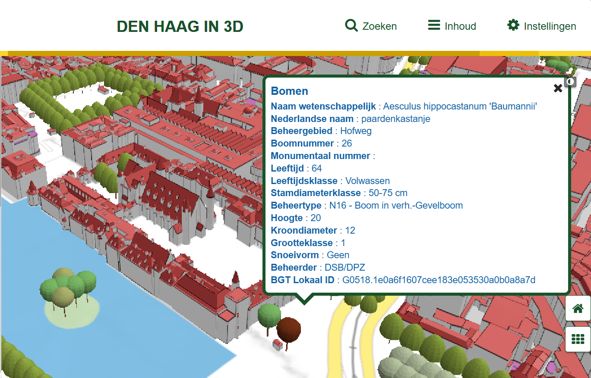
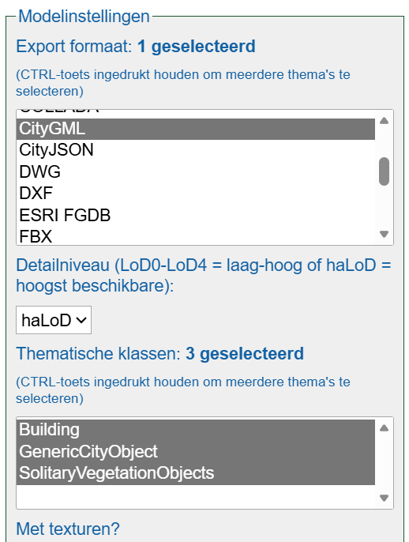
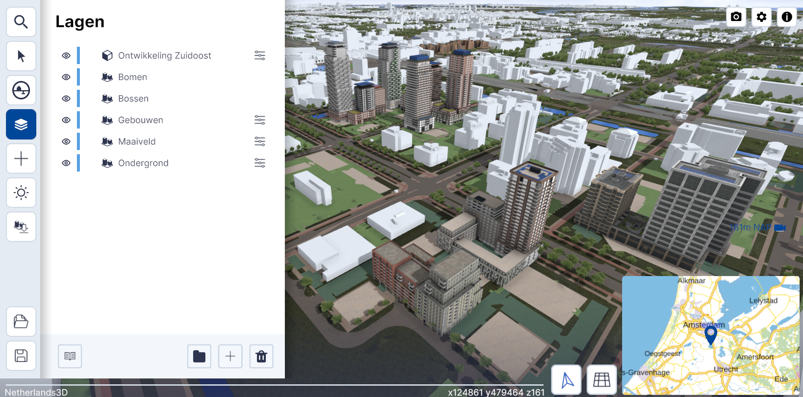
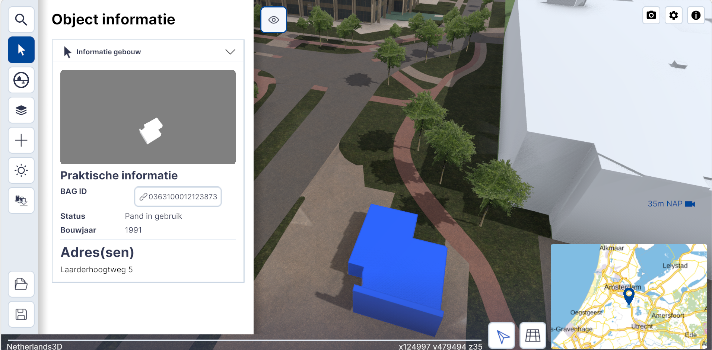
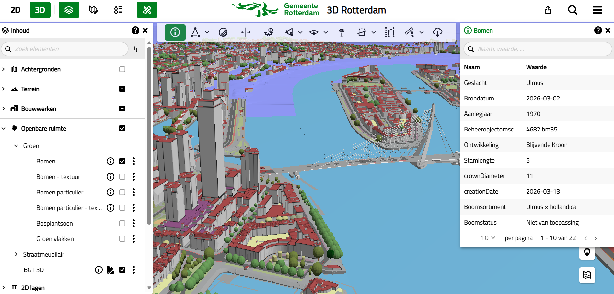

## Overzicht van 3D steden

### Den Haag
[Den Haag in 3D](https://www.denhaagin3d.nl/)




### Amsterdam en Utrecht

Amsterdam en Utrecht in 3D zijn nu helemaal overgegaan in: 

[Netherlands3D](https://netherlands3d.eu/)







### 3D Rotterdam

[3D Rotterdam](https://www.3drotterdam.nl/)


## Vergelijking 

Een vergelijking laat zien dat de CityGML structuur van de modellen, die zijn gedownload vanuit verschillende 3D-omgevingen (in de vergelijking Rotterdam 3D en Amsterdam 3D), anders is. 

Beide modellen maken gebruik van een CityGML Building. De attributen van de CityGML concepten zijn anders en decompostie is ook anders. 

De structuur van Rotterdam is Building -> BuildingPart -> lod2Solid
De structuur van Den Haag is Building -> lod2Solid


```gml
 <cityObjectMember>
    <bldg:Building gml:id="BAG_0599100000700770">
      <gml:boundedBy>
        <gml:Envelope srsName="urn:ogc:def:crs:EPSG::28992" srsDimension="3">
          <gml:lowerCorner>92583.943 435862.057 2.774562</gml:lowerCorner>
          <gml:upperCorner>92643.0 435940.98 32.561112</gml:upperCorner>
        </gml:Envelope>
      </gml:boundedBy>
      <creationDate>2024-11-01</creationDate>
      <gen:stringAttribute name="WIJK">
        <gen:value>Rotterdam Centrum</gen:value>
      </gen:stringAttribute>
      <gen:stringAttribute name="PANDSOORT">
        <gen:value>Ingesloten hoekpand</gen:value>
      </gen:stringAttribute>
      <gen:stringAttribute name="LAAGSTE_BOUWLAAG">
        <gen:value>-1</gen:value>
      </gen:stringAttribute>
      <gen:stringAttribute name="HOOGSTE_BOUWLAAG">
        <gen:value>4</gen:value>
      </gen:stringAttribute>
      <gen:stringAttribute name="BUURT">
        <gen:value>Nieuwe Werk</gen:value>
      </gen:stringAttribute>
      <gen:stringAttribute name="BEGINGELDIGHEID">
        <gen:value>2016-02-07</gen:value>
      </gen:stringAttribute>
      <gen:stringAttribute name="AANTAL_BOUWLAGEN">
        <gen:value>6</gen:value>
      </gen:stringAttribute>
      <gen:stringAttribute name="AANTAL_ADRESSEN">
        <gen:value>1</gen:value>
      </gen:stringAttribute>
      <bldg:yearOfConstruction>1897</bldg:yearOfConstruction>
      <bldg:measuredHeight uom="#m">29.79</bldg:measuredHeight>
      <bldg:consistsOfBuildingPart>
        <bldg:BuildingPart gml:id="ID_9388780e-e02f-47d4-a2e5-a45b1af215f0">
          <creationDate>2024-11-01</creationDate>
          <bldg:measuredHeight uom="">11.064675217455388</bldg:measuredHeight>
          <bldg:lod2Solid>
            <gml:Solid gml:id="ID_ab8820e8-de15-4e29-b87e-daecae488c4c">
              <gml:exterior>
                <gml:CompositeSurface gml:id="ID_e7ed2d73-1f0b-43c6-b142-da7beb49603b">
                  <gml:surfaceMember xlink:href="#ID_bc0354e2-b529-4a2a-8bcc-233a03a5c885"/>
...

...
                  <gml:surfaceMember xlink:href="#ID_c6b6f432-6ada-4b48-a4c6-72cfef1e7fac"/>
                </gml:CompositeSurface>
              </gml:exterior>
            </gml:Solid>
          </bldg:lod2Solid>
          <bldg:boundedBy>
            <bldg:RoofSurface gml:id="ID_0ab83a89-0bcf-4e4a-a733-a19c9da5cc26">
              <creationDate>2024-11-01</creationDate>
              <bldg:lod2MultiSurface>
                <gml:MultiSurface gml:id="ID_3900c9c9-84ac-4ea9-952c-ccd5be37fd71">
                  <gml:surfaceMember>
                    <gml:Polygon gml:id="ID_b54123de-1ab8-4142-89f6-59afed96f715">
                      <gml:exterior>
                        <gml:LinearRing gml:id="ID_b54123de-1ab8-4142-89f6-59afed96f715_0_">
                          <gml:posList srsDimension="3">92596.000153 435898.51558 13.839237 92607.913646 435902.721263 13.839237 92597.55 435901.02 12.339237 92595.40422 435900.308472 12.304006 92596.000153 435898.51558 13.839237</gml:posList>
                        </gml:LinearRing>
                      </gml:exterior>
                    </gml:Polygon>
                  </gml:surfaceMember>
                </gml:MultiSurface>
              </bldg:lod2MultiSurface>
            </bldg:RoofSurface>
          </bldg:boundedBy>
          <bldg:boundedBy>
            <bldg:WallSurface gml:id="ID_8f574d92-633e-44ff-a135-bc6d164f36e6">
              <creationDate>2024-11-01</creationDate>
              <bldg:lod2MultiSurface>
                <gml:MultiSurface gml:id="ID_f3344ad5-4bcc-4dc8-97d9-753d74a994f4">
                  <gml:surfaceMember>
                    <gml:Polygon gml:id="ID_bc0354e2-b529-4a2a-8bcc-233a03a5c885">
                      <gml:exterior>
                        <gml:LinearRing gml:id="ID_bc0354e2-b529-4a2a-8bcc-233a03a5c885_0_">
                          <gml:posList srsDimension="3">92607.913646 435902.721263 2.774562 92605.94 435904.14 2.774562 92605.94 435904.14 12.095487 92607.913646 435902.721263 13.839237 92607.913646 435902.721263 2.774562</gml:posList>
                        </gml:LinearRing>
                      </gml:exterior>
                    </gml:Polygon>
                  </gml:surfaceMember>
                </gml:MultiSurface>
              </bldg:lod2MultiSurface>
            </bldg:WallSurface>
          </bldg:boundedBy>
```

Anders is dan de structuur van Den Haag 

```gml
 <cityObjectMember>
    <bldg:Building gml:id="bag_0518100000203597">
      <gml:boundedBy>
        <gml:Envelope srsName="urn:ogc:def:crs:EPSG::28992" srsDimension="3">
          <gml:lowerCorner>81272.4512552872 455028.679790001 -0.471617319105345</gml:lowerCorner>
          <gml:upperCorner>81403.477 455164.4 34.2791284465218</gml:upperCorner>
        </gml:Envelope>
      </gml:boundedBy>
      <creationDate>2024-12-18</creationDate>
      <gen:doubleAttribute name="Volume">
        <gen:value>104797.07</gen:value>
      </gen:doubleAttribute>
      <gen:doubleAttribute name="Dakoppervlakte">
        <gen:value>8542.52</gen:value>
      </gen:doubleAttribute>
      <gen:doubleAttribute name="Muuroppervlakte">
        <gen:value>13883.88</gen:value>
      </gen:doubleAttribute>
      <gen:doubleAttribute name="Vloeroppervlakte">
        <gen:value>5073.26</gen:value>
      </gen:doubleAttribute>
      <gen:doubleAttribute name="hoogte_Z_max_in_m_NAP">
        <gen:value>34.28</gen:value>
      </gen:doubleAttribute>
      <gen:stringAttribute name="GEB_DOEL">
        <gen:value>kantoorfunctie - kantoorfunctie,woonfunctie</gen:value>
      </gen:stringAttribute>
      <bldg:yearOfConstruction>1620</bldg:yearOfConstruction>
      <bldg:measuredHeight uom="#m">34.75</bldg:measuredHeight>
      <bldg:lod2Solid>
        <gml:Solid gml:id="ID_810078dd-af5f-4cab-a8b8-40f94430526a">
          <gml:exterior>
            <gml:CompositeSurface gml:id="ID_66c3cb51-4f7e-4d76-bbc6-46de7402c23b">
              <gml:surfaceMember xlink:href="#ID_00042ff6-1a9d-42e8-9d91-a1245a9ac902"/>
...

...
              <gml:surfaceMember xlink:href="#ID_19c89fdc-f379-479d-a622-e8c8767f16b5"/>
            </gml:CompositeSurface>
          </gml:exterior>
        </gml:Solid>
      </bldg:lod2Solid>
      <bldg:outerBuildingInstallation>
        <bldg:BuildingInstallation gml:id="ID_4cfe070b-12a0-4f86-81c8-5bc8064d5b06">
          <creationDate>2024-12-18</creationDate>
          <bldg:boundedBy>
            <bldg:RoofSurface gml:id="ID_4e5d9fb7-0cdb-451d-9d29-bfdc6b091f6d">
              <creationDate>2024-12-18</creationDate>
              <bldg:lod2MultiSurface>
                <gml:MultiSurface gml:id="ID_51f6e276-593a-40d1-8d5f-9405c24fe756">
                  <gml:surfaceMember>
                    <gml:Polygon gml:id="ID_9274f5e7-e8c9-4564-8ab6-d098ff160e53">
                      <gml:exterior>
                        <gml:LinearRing gml:id="ID_9274f5e7-e8c9-4564-8ab6-d098ff160e53_0_">
                          <gml:posList srsDimension="3">81348.0225 455049.7604 18.0095835851885 81348.5915315942 455047.835548389 18.0095511940403 81349.8887787634 455048.219049317 18.0095338815289 81349.3198 455050.1439 18.009566271776 81348.0225 455049.7604 18.0095835851885</gml:posList>
                        </gml:LinearRing>
                      </gml:exterior>
                    </gml:Polygon>
                  </gml:surfaceMember>
                </gml:MultiSurface>
              </bldg:lod2MultiSurface>
            </bldg:RoofSurface>
          </bldg:boundedBy>
          <bldg:boundedBy>
            <bldg:WallSurface gml:id="ID_310ad98d-164d-476b-bf75-1ba563e37395">
              <creationDate>2024-12-18</creationDate>
              <bldg:lod2MultiSurface>
                <gml:MultiSurface gml:id="ID_490022d2-aac7-4038-8296-16b7afb25d61">
                  <gml:surfaceMember>
                    <gml:Polygon gml:id="ID_ccf395cb-efbc-4e60-b37c-63e70ef6f0a1">
                      <gml:exterior>
                        <gml:LinearRing gml:id="ID_ccf395cb-efbc-4e60-b37c-63e70ef6f0a1_0_">
                          <gml:posList srsDimension="3">81348.5915 455047.8355 15.8194092784609 81349.8888 455048.219 15.8193919650484 81349.8887787634 455048.219049317 18.0095338815289 81348.5915315942 455047.835548389 18.0095511940403 81348.5915 455047.8355 15.8194092784609</gml:posList>
                        </gml:LinearRing>
                      </gml:exterior>
                    </gml:Polygon>
                  </gml:surfaceMember>
                </gml:MultiSurface>
              </bldg:lod2MultiSurface>
            </bldg:WallSurface>
```

```json
{
    "type": "CityJSON",
    "version": "2.0",
    "transform": {
        "scale": [
            0.001,
            0.001,
            0.001
        ],
        "translate": [
            89962.06999999999,
            433979.901,
            -8.25
        ]
    },
    "CityObjects": {
        "NL.IMBAG.Pand.0599100000629501": {
            "type": "Building",
            "geographicalExtent": [
                91734.55001611328,
                434121.58005371096,
                -0.7990000247955322,
                91742.85000390623,
                434149.7420410157,
                9.32091236114502
            ],
            "attributes": {
                "beginGeldigheid": "2015/10/09",
                "documentDatum": "2015/10/09",
                "documentNummer": "Corsanr.15/54428",
                "eindGeldigheid": null,
                "eindRegistratie": null,
                "force_low_lod": false,
                "geconstateerd": "0",
                "identificatie": "NL.IMBAG.Pand.0599100000629501",
                "oorspronkelijkBouwjaar": 1931,
                "rf_extrusion_mode": "standard",
                "rf_force_lod11": false,
                "rf_h_ground": -0.7990000247955322,
                "rf_h_pc_98p": 0.0,
                "rf_h_roof_ridge": null,
                "rf_is_glass_roof": false,
                "rf_is_mutated_AHN4_2024": false,
                "rf_is_mutated_AHN5_AHN4": false,
                "rf_nodata_frac_2024": 0.0,
                "rf_nodata_frac_AHN4": 0.0,
                "rf_nodata_frac_AHN5": 0.02476780116558075,
                "rf_nodata_r_2024": 0.0,
                "rf_nodata_r_AHN4": 0.015204249881207945,
                "rf_nodata_r_AHN5": 0.0,
                "rf_pc_select": "PREFERRED_AND_LATEST",
                "rf_pc_source": "AHN5",
                "rf_pc_year": 2022,
                "rf_pointcloud_unusable": false,
                "rf_pt_density_2024": 153.1021728515625,
                "rf_pt_density_AHN4": 48.27863693237305,
                "rf_pt_density_AHN5": 24.596824645996097,
                "rf_reconstruction_time": 69,
                "rf_ridgelines": 0,
                "rf_rmse_lod12": 4.2276434898376465,
                "rf_rmse_lod13": 1.252471923828125,
                "rf_rmse_lod22": 0.33890005946159363,
                "rf_roof_elevation_50p": 5.064000129699707,
                "rf_roof_elevation_70p": 9.11400032043457,
                "rf_roof_elevation_max": 9.407999992370604,
                "rf_roof_elevation_min": 2.3450000286102295,
                "rf_roof_n_planes": 9,
                "rf_roof_type": "slanted",
                "rf_success": true,
                "rf_val3dity_lod12": "[]",
                "rf_val3dity_lod13": "[]",
                "rf_val3dity_lod22": "[]",
                "rf_volume_lod12": 1598.6104736328125,
                "rf_volume_lod13": 1183.526611328125,
                "rf_volume_lod22": 1083.4688720703125,
                "status": "Pand in gebruik",
                "tijdstipEindRegistratieLV": null,
                "tijdstipInactief": null,
                "tijdstipInactiefLV": null,
                "tijdstipNietBagLV": null,
                "tijdstipRegistratie": "2015/10/10 14:44:01",
                "tijdstipRegistratieLV": "2015/10/12 08:31:14.203",
                "voorkomenIdentificatie": 3
            },
            "geometry": [
                {
                    "type": "MultiSurface",
                    "lod": "0",
                    "boundaries": [
                        [
                            [
                                15058,
                                15059,
                                15060,
                                15061,
                                15062
                            ]
                        ]
                    ]
                }
            ],
            "children": [
                "NL.IMBAG.Pand.0599100000629501-0"
            ]
        },

...

...

       "NL.IMBAG.Pand.0599100000629501-0": {
            "type": "BuildingPart",
            "geometry": [
                {
                    "type": "Solid",
                    "lod": "1.2",
                    "boundaries": [
                        [
                            [
                                [
                                    15061,
                                    15060,
                                    15059,
                                    15058,
                                    15062
                                ]
                            ],
  ...

  ...
                            [
                                [
                                    15064,
                                    15066,
                                    15067,
                                    15065,
                                    15063
                                ]
                            ]
                        ]
                    ],
                    "semantics": {
                        "surfaces": [
                            {
                                "type": "GroundSurface"
                            },
                            {
                                "on_footprint_edge": true,
                                "type": "WallSurface"
                            },
                            {
                                "on_footprint_edge": false,
                                "type": "WallSurface"
                            },
                            {
                                "rf_roof_elevation_50p": 5.0948591232299805,
                                "rf_roof_elevation_70p": 9.14976406097412,
                                "rf_roof_elevation_max": 9.319270133972168,
                                "rf_roof_elevation_min": 2.261930465698242,
                                "type": "RoofSurface"
                            }
                        ],
                        "values": [
                            [
                                0,
                                1,
                                1,
                                1,
                                1,
                                1,
                                3
                            ]
                        ]
                    }
                },
                {
                    "type": "Solid",
                    "lod": "1.3",
                    "boundaries": [
                        [
                            [
                                [
                                    15059,
                                    15068,
                                    15058,
                                    15062,
                                    15061,
                                    15069,
                                    15060
                                ]
                            ],
 ...

 ...
                            [
                                [
                                    15078,
                                    15070,
                                    15071,
                                    15073
                                ]
                            ]
                        ]
                    ],
                    "semantics": {
                        "surfaces": [
                            {
                                "type": "GroundSurface"
                            },
                            {
                                "on_footprint_edge": true,
                                "type": "WallSurface"
                            },
                            {
                                "on_footprint_edge": false,
                                "type": "WallSurface"
                            },
                            {
                                "rf_roof_elevation_50p": 4.954113483428955,
                                "rf_roof_elevation_70p": 5.052464962005615,
                                "rf_roof_elevation_max": 9.161148071289064,
                                "rf_roof_elevation_min": 2.261930465698242,
                                "type": "RoofSurface"
                            },
                            {
                                "rf_roof_elevation_50p": 9.19798755645752,
                                "rf_roof_elevation_70p": 9.228066444396973,
                                "rf_roof_elevation_max": 9.319270133972168,
                                "rf_roof_elevation_min": 9.094504356384276,
                                "type": "RoofSurface"
                            }
                        ],
                        "values": [
                            [
                                0,
                                1,
                                1,
                                1,
                                1,
                                1,
                                2,
                                1,
                                1,
                                3,
                                4
                            ]
                        ]
                    }
                },
                {
                    "type": "Solid",
                    "lod": "2.2",
                    "boundaries": [
                        [
...    
```

Dit is een fragment uit de 3D Basisvoorziening in CityJSON. Waarin een BAG-Pand als Building (LoD 0) en in meer detail als BuildingPart (LoD1.2 tot 2.2) wordt gemodelleerd. Een buildingpart wordt als child van een Building gemodelleerd. 