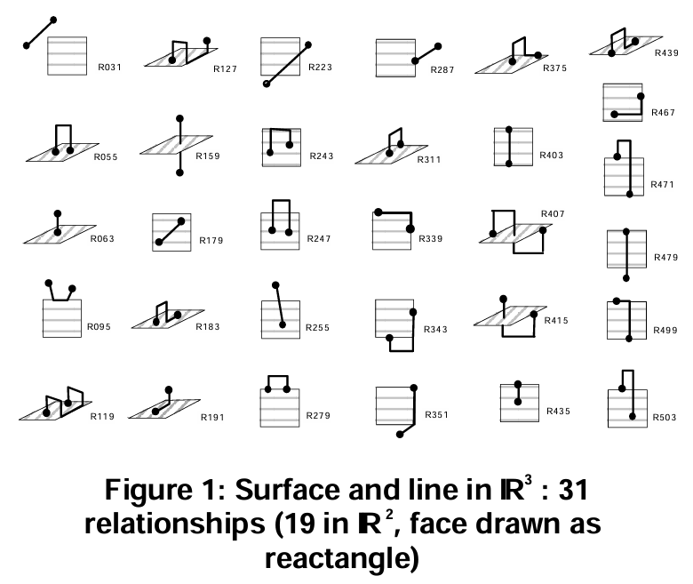
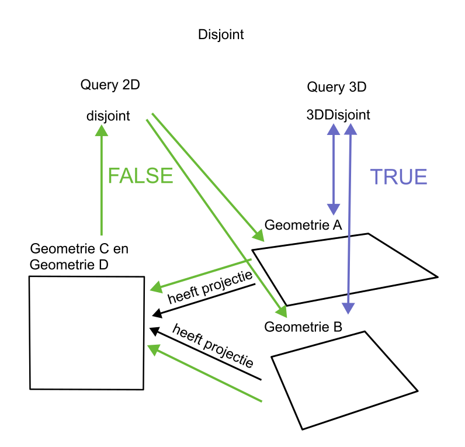

# 3D Topologische relaties 
Een topologische relatie beschrijft hoe objecten ruimtelijk met elkaar verbonden zijn. Ligt iets in, op, naast of over elkaar? Raken objecten elkaar? Of zijn deze gescheiden? 

Om dit geformaliseerd te kunnen duiden en wiskundig te kunnen berekenen zijn standaard topologische modellen beschikbaar. Een belangrijk topologische model dat formeel erkend is door het OGC in de [Simple Feature Access](https://www.ogc.org/standards/sfa/) is het Dimensionally Extended 9–Intersection Model (DE-9IM). 

### DE-9IM
Het DE-9IM splitst geometrie op in binnen (interior), grens (boundary) en buiten (exterior). Het model voorziet naast 2D vlakken ook in andere dimensies zoals 0D punten, 1D lijnen en 3D volumes. 

<figure id="Binnen-buiten-grens-van-geometrie">
      
    <figcaption><a class="self-link" href="#fig-Binnen-buiten-grens-van-geometrie"></bdi></a>Binnen, buiten en grens van geometrie</figcaption>
</figure>

De topologische relatie tussen twee geometrieën wordt bepaald door te kijken of en hoe grens, binnen en buiten elkaar snijden. Niet of wel, en als wel met welke dimensie. In het DE-9IM-model wordt de topologische relatie bepaald door de 3×3-matrix van intersecties tussen interieur, grens en exterieur. Een punt heeft geen grens, een lijn heeft een set van eindpunten als grens, een vlak heeft een gesloten lijn als grens en een volume heeft een vlak als grens. 

<figure id="Intersectie_model_2D">
      
    <figcaption><a class="self-link" href="#fig-Topologische_Relaties_in_2D"></bdi></a>Intersectiemodel van twee 2D vlakken die overlappen</figcaption>
</figure>

<figure id="Intersectie_model_3D">
      
    <figcaption><a class="self-link" href="#fig-Topologische_Relaties_in_3D"></bdi></a>Intersectiemodel van 3D volumes die overlappen</figcaption>
</figure>

De patronen van de matrix van de intersecties definiëren bijvoorbeeld onderstaande relaties:  

<figure id="Topologische_Relaties_2D_vlakken">
      
    <figcaption><a class="self-link" href="#fig-Topologische_Relaties_in_3D"></bdi></a>Topologische relatie van twee vlakken</figcaption>
</figure>

<figure id="Topologische_Relaties_3D_volumes">
      
    <figcaption><a class="self-link" href="#fig-Topologische_Relaties_in_3D"></bdi></a>Topologische relatie van twee 3D volumes</figcaption>
</figure>

Deze relaties zijn in de simple features access formeel gedefinieerd voor 2D‑geometrieën Ondanks dat het mogelijk is om de intersectierelaties toe te passen in 3D. 

De namen van de topologische relaties zoals Egenhofer, RCC, ST en NEN3610 kunnen verschillen: 
| Egenhofer (DE-9IM): | RCC:| ST | NEN 3610
|---   | ---- | ---- | --- |
| Disjoint | DC | Disjoint | 
| Meets/Touches | EC | Touches | 
| Overlaps | PO | Overlaps/intersect | 
| Contains | NTPPi | contains | 
| Within | NTTP | Within | 
| Equal | EQ | Equals | equals |

### NEN3610
De NEN3610 verwijst in hoofdstuk 9.12 naar de OGC Simple Features Acces standaard. In de NEN staat: "NEN 3610 volgt hiervoor de OGC Simple Features Access-standaard, waarin het Dimensionally Extended 9-Intersection Model (DE-9IM) wordt gebruikt. De 'spatial predicates' hierin zijn hieronder opgenomen met de Engelse term uit OGC Simple Features Access. Voor de definitie wordt naar die OGC-standaard verwezen." 

De NEN 3610 definieert vervolgens: 

- equals 
- disjoint 
- intersects 
- touches
- crosses
- within
- contains 
- overlaps

### Simple Features Access topologie
Wanneer men werkt met Simple Features  wordt het vaak op 3D-gegevens gebruikt door de geometrie in 2D te projecteren, maar dit betekent dat sommige 3D-topologische nuances (zoals “boven/op elkaar” in de Z-richting) niet worden gemodelleerd.

De Simple Features Access schrijft in Part 1, Hoofdstuk 6.1.2.5: "Spatial operations work in the "map geometry" of the data and will therefore not reflect z or m values in calculations (e.g., Equals, Length) or in generation of new geometry values (e.g., Buffer, ConvexHull, Intersection). This is done by projecting the geometric objects onto the horizontal plane to obtain a "footprint" or "shadow" of the objects for the purposed of map calculations. In other words, it is possible to store and obtain z (and m) coordinate values but they are ignored in all other operations which are based on map geometries. Implementations are free to include true 3D geometric operations, but should be consistent with ISO 19107.."  

Verder in Part 1, hoofdstuk 6.1.15 schrijft de Simple Features Access: "The relational operators are Boolean methods that are used to test for the existence of a specified topological spatial relationship between two geometric objects as they would be represented on a map. Topological spatial relationships between two geometric objects have been a topic of extensive study. The basic approach to comparing two geometric objects is to project the objects onto the 2D horizontal coordinate reference system representing the Earth's surface, and then to make pair-wise tests of the intersections between the interiors, boundaries and exteriors of the two projections and to classify the map relationship between the two geometric objects based on the entries in the resulting 3 by 3 ‘intersection’ matrix. The concepts of interior, boundary and exterior are well defined as sets of point geometry, and abstracted in general topology. It is important to note that the calculation of the following operations will give equivalent results whether the calculations are done using classical geometric representations or these same calculations are done with algebraic techniques in a well-structured and properly defined equivalent topological structure. 
These concepts are applied in this standard for defining spatial relationships between 2-dimensional objects in 2-dimensional space (ℜ2) by the projection of the objects onto the horizontal surface usually represented in a map. 
This will give a different result than would be obtained if the full 3D geometry (or its corresponding 3D topology) because of the changes induced in the projection of the objects onto the horizontal map projection. It would be possible to define a full 3D set of operations, but the increase in computational complexity can be prohibitive to most implementations, and is generally not supported in many geographic information systems or other applications dealing with significant volumes of "mapping data." Specification of full 3D operators following this same pattern for higher dimensions is reserved for a future version of this standard.

De Simple Features Access definieert naast de ruimtelijke relaties ook een aantal analyse methode als: 
- distance 
- buffer
- convexHull
- intersection
- union
- difference 
- symDifference

De definities van ruimtelijke relaties en analyses in 2D en 3D kunnen tot verwarring leiden. Als men 2 3D-geometriën bevraagt op de topologische relatie en het antwoord is "Overlaps" kan het onduidelijk zijn wat hier mee bedoeld wordt. Ook vragen als wat is de "Distance" tussen deze twee geometriën kan verkeerd worden geïnterpreteerd.

<figure id="3D_vs_2D_geometrie_disjoint_vs_overlap">
      
    <figcaption><a class="self-link" href="#fig-3D_vs_2D_geometrie_disjoint_vs_overlap"></bdi></a>3D vs 2D project Disjoint vs Overlap"</figcaption>
</figure>

<figure id="3D_vs_2D_geometrie_distance">
      
    <figcaption><a class="self-link" href="#fig-3D_vs_2D_geometrie_disjoint_vs_overlap"></bdi></a>3D vs 2D project Disjoint vs Overlap"</figcaption>
</figure>

## ISO 191007 
Implementaties zijn volgens de Simple Features Access vrij om 3D topologische relaties en analyses te duiden met de ISO 191007. Deze ISO geeft in hoofdstuk 6.4.8.8 de volgende relaties

<table>
  <tr>
    <th>2D</th>
    <th>3D</th>
  </tr>
  <tr>
    <td colspan="2">Omhulling</td>
  </tr>
  <tr>
    <td>boundaryType</td>
    <td>3DBoundary</td>
  </tr>
    <tr>
    <td colspan="2"><strong>Set</strong></td>
  </tr>
  <tr>
    <td>intersection</td>
    <td>3Dintersection</td>
  </tr>
  <tr>
    <td>difference</td>
    <td>3Ddifference</td>
  </tr>
  <tr>
    <td>symDifference</td>
    <td>3DsymDifference</td>
  </tr>
  <tr>
    <td>union</td>
    <td>3Dunion</td>
  </tr>
  <tr>
    <td colspan="2"><strong>query</strong></td>
  </tr>
  <tr>
    <td>contains</td>
    <td>3Dcontains</td>
  </tr>
  <tr>
  <td>crosses</td>
    <td>3Dcrosses</td>
  </tr>
  <tr>
  <td>disjoint</td>
    <td>3Ddisjoint</td>
  </tr>
  <tr>
  <td>equals</td>
    <td>3Dequals</td>
  </tr>
  <tr>
  <td>intersects</td>
    <td>3Dintersects</td>
  </tr>
  <tr>
  <td>overlaps</td>
    <td>3Doverlaps</td>
  </tr>
  <tr>
  <td>touches</td>
    <td>3Dtouches</td>
  </tr>
  <tr>
  <td>within</td>
    <td>3Dwithin</td>
  </tr>
  <tr>
  <td>withinDistance</td>
    <td>3DwithinDistance</td>
  </tr>
  <tr>
    <td colspan="2"><strong>Omhulling</strong></td>
  </tr>
  <tr>
  <td>relate</td>
    <td>3Drelate</td>
  </tr>
</table>

In de ISO191007 introduceert hiermee een speciale set aan 3D topologische relaties die alleen anders zijn van de 2D topologische relaties wanneer alle geometrie waarmee gewerkt wordt 3D is. 

Dit is ook terug te zien in software.Zie [ST_3DIntersects](https://postgis.net/docs/ST_3DIntersects.html) en zie [PostGIS 3D Functions](https://postgis.net/workshops/postgis-intro/3d.html)

Hiermee wordt onderscheid gemaakt tussen *disjoint* in 2D en 3D. Dit onderscheid is echter niet semantisch van aard: in beide gevallen betekent *disjoint* dat twee geometrieën geen enkel gemeenschappelijk punt delen. Het verschil ligt uitsluitend in de dimensionele context waarin de relatie wordt geëvalueerd, respectievelijk in een tweedimensionale projectie of in de driedimensionale ruimte. 

De NEN3610 beschrijft als aanbeveling: 

> ***Aanbeveling /abv/3d/toporeg***
Breid de set topologische regels uit voor specifieke 3D-situaties. Bepaal welke eisen wenselijk zijn, bijvoorbeeld rond vlakdekkendheid van glooiende terreinen en de aansluiting van objecten als bruggen en objecten op dat terrein. 

Deze aanbeveling is voor een 3D-standaard waarbij topologische bevragingen van belang zijn essentieel.  

<aside class="note" title="Definieer topologische regels">
  
<strong>AANBEVELING:</strong> Definieer een set topologische regels voor specifieke 3D-situaties gebaseerd op het DE-9IM model en de ISO191007.

</aside>

### RCC*-9
Het combineren van verschillende dimensies 3D geometrieën bij het analyseren van topologische relaties is een uitdaging. In een beschrijving van een uitbreiding van het RCC-8 en DE-9IM model[RCC-9 and CBM](https://www.researchgate.net/publication/267213170_RCC-9_and_CBM)
en [extension of RCC*-9 to complex and three-dimensional features and its reasoning system](https://www.mdpi.com/2220-9964/13/1/25#Definition_of_RCC9) wordt hiervoor een oplossing geschetst. 

De relatie "Overlaps" had als definitie: de twee regio's delen een gemeenschappelijk deel, maar zijn niet elkaars subset. In de RCC*9, omdat daar ook lijnen, punten en volumes in meegenomen kunnen worden, wordt dit ingewikkelder. Twee vlakken die een gemeenschappelijk deel hebben, overlappen sowieso. Maar bij twee lijnen hoeft dit niet persé een overlap te zijn. Dit kan ook een Cross, "kruist", relatie zijn. Ook een punt op een lijn gaf de vraag of dit een Overlap of External Connect relatie moet zijn. Dit is opgelost. 

De specificatie schrijft over grenzen die één dimensie lager zijn dan de geometrie zelf. 
De grens van een volume is een vlak, de grens van een vlak is een lijn, de grens van een lijn is een punt. Ook beschrijft het onderzoek nieuwe 3D objecten. Gaten in 3D geometrie zijn anders dan in 2D. Een object met een gat in 2D kan in 3D een object met een gat als een donut zijn of een object met een gat als in een voetbal. Dit zijn twee verschillende objecten in 3D. 

De uitbreiding naar 3D-objecten en bijbehorende multidimensionele topologische relaties zoals gedefinieerd in het onderzoek wordt op dit moment niet door het Simple features Access model ondersteunt. 

<aside class="note" title="Gebruik het RCC*-9 onderzoek voor het opstellen van een 3D-standaard">
  
<strong>AANBEVELING:</strong> Onderzoek de voorgestelde wijzigingen in het RCC*-9 onderzoek om te komen tot een uitbreiding van geometrie en topologische definities om te komen tot een 3D-standaard

</aside>

De topologische regel in de 2D BGT is dat de vlakken op eenzelfde relatieve hoogteligging niet overlappend mogen zijn. Het moet vlakdekkend zijn. Wanneer basisregistraties uit 3D geometriën bestaan en er zelfde soort vlakdekkende eisen zijn dienen er nieuwe topologische relatie afspraken voor 3D gemaakt te worden. 

<aside class="note" title="3D-vlakdekkende basisregistraties">
  
<strong>AANBEVELING:</strong> Stel nieuwe 3D topologische relaties op voor 3D basisregistraties die bijvoorbeeld vlakdekkend dienen te zijn. 

</aside>

De hierboven besproken 3D topologische relaties kan men inzetten. In twee dimensies is de variatie aan mogelijke verbindingen beperkter dan in drie dimensies. De overgang naar 3D introduceert nieuwe topologische vrijheidsgraden die leiden tot een aanzienlijk rijkere verzameling van mogelijke “meets/touches”-situaties. De vraag is of er voldoende betekenis te geven is met de hierboven beschreven 3D-topologische relaties. Onderstaande voorbeelden kennen allen de topologische relatie "Meet/Touches (grenst aan)"

<figure id="Topologische_Relatie_3D_grenst_aan">
      
    <figcaption><a class="self-link" href="#fig-Topologische_Relaties_in_3D"></bdi></a>Zes voorbeelden van een zelfde topologische relaties "grenst aan"</figcaption>
</figure>

## Praktijkvoorbeeld
Om het gebruik van topologische relaties te verduidelijken, is een praktijkvoorbeeld uitgewerkt. Dit laat zien hoe ruimtelijke objecten zich tot elkaar verhouden en hoe deze relaties in de praktijk worden toegepast.

<figure id="3D_Infrastructureel_werk">
      
    <figcaption><a class="self-link" href="#fig-3D_Infrastructureel_werk"></bdi></a>Een voorbeeld model van een viaduct over een snelweg"</figcaption>
</figure>

Dit kan men zowel uitdrukken in IFC als in CityGML:

<figure id="3D_Infrastructureel_werk_CityGML">
      
    <figcaption><a class="self-link" href="#fig-3D_Infrastructureel_werk_CityGML"></bdi></a>CityGML-concepten waarmee men een model van een viaduct over een snelweg kan modelleren"</figcaption>
</figure>
<figure id="3D_Infrastructureel_werk_IFC">
      
    <figcaption><a class="self-link" href="#fig-3D_Infrastructureel_werk_IFC"></bdi></a>IFC-concepten waarmee men een model van een viaduct over een snelweg kan modelleren"</figcaption>
</figure>

De elementen in CityGML en IFC zijn als volgt: 

<table>
  <tr>
        <td>CityGML</td>
        <td>IFC</td>
    </tr>
    <td>

- **`CityGML:Bridge`**: *`Viaduct Cattenbroekerdijk`*
  - **`CityGML:BridgePart`**: `Overspanning`
    - **`CityGML:ConstructiveElement`**: `Brugdek A`
    - **`CityGML:ConstructiveElement`**: `…`
  - **`CityGML:BridgePart`**: `Landhoofd A`
    - **`CityGML:ConstructiveElement`**: `Oplegconstructie A`
    - **`CityGML:ConstructiveElement`**: `…`

- **`CityGML:Road`**: *`A12`*
  - **`CityGML:TrafficSpace`**: `A`
    - **`CityGML:TrafficArea`**: `A`
  - **`CityGML:TrafficSpace`**: `B`
    - **`CityGML:TrafficArea`**: `B`
  - **`CityGML:TrafficSpace`**: `C`
    - **`CityGML:TrafficArea`**: `B`
  - **`CityGML:ConstructiveElement`**: `Wegdek`

- **`CityGML:Road`**: *`E25`*
  - **`CityGML:TrafficSpace`**: `D`
    - **`CityGML:TrafficArea`**: `D`
  - **`CityGML:TrafficSpace`**: `E`
    - **`CityGML:TrafficArea`**: `E`
  - **`CityGML:ConstructiveElement`**: `Wegdek B`
</td>
<td>

- **`IfcBridge`**: *`Viaduct Cattenbroekerdijk`*
  - **`IfcBridgePart`**: `Overspanning`
    - **`IfcSlab`**: `Brugdek A`
    - **`IfcBeam`**: `…`
  - **`IfcBridgePart`**: `Landhoofd`
    - **`IfcSlab`**: `Oplegconstructie`
    - **`IfcPile`**: `…`

- **`IfcRoad`**: *`A12`*
  - **`IfcRoadPart`**: `Rijrichting A`
    - **`IfcSlab`**: `Wegdek A`
    - **`IfcSpace`**: `Rijbaanruimte A`
    - **`IfcSpace`**: `Rijbaanruimte B`
    - **`IfcSpace`**: `Rijbaanruimte C`

- **`IfcRoad`**: *E25*
  - **`IfcRoadPart`**: `Rijrichting B`
    - **`IfcSlab`**: `Wegdek B`
    - **`IfcSpace`**: `Rijbaanruimte D`
    - **`IfcSpace`**: `Rijbaanruimte E`

</td>
</table>

Ten behoeve van consistentie van vlakdekkende kaarten zoals de BGT of ten behoeve van clashdetecties zijn topologische relaties als overlap, touches en disjoint belangrijk. De 2D en 3D topologische relaties tussen de elementen van deze praktijkcases verschillen. Een 3D standaard moet voorkomen dat (menselijke) interpretatie afhangt van projecties. Goed gedefinieerde 3D-topologische afspraken maken ruimtelijke relaties eenduidig en interpreteerbaar, waardoor ze zowel door mensen als machines begrepen kunnen worden.

<figure id="3D_Infrastructureel_werk_Topologisch_2D">
      
    <figcaption><a class="self-link" href="#fig-3D_Infrastructureel_werk_Topologisch_2D"></bdi></a>Topologisch 2D spatial operators voor een 3D model"</figcaption>
</figure>

<figure id="3D_Infrastructureel_werk_Topologisch_3D">
      
    <figcaption><a class="self-link" href="#fig-3D_Infrastructureel_werk_Topologisch_3D"></bdi></a>Topologisch 3D spatial operators voor een 3D model"</figcaption>
</figure>

# Geometrische inbedding en Co-dimensie
Een geometrie met een bepaalde topologische dimensie (dimX) kan in elke n-dimensionale ruimte bestaan, zolang geldt: n ≥ dimX. 

Stel men heeft een lijn in 1D, dan kan men die in 2D zetten door een '0' aan het coordinaat toe te voegen. 

x wordt dan (x,0)

Hiermee verandert men de ruimte, niet het object zelf. De dimensie van het object blijft 1. Dit noemt men embedding, of in het nederlands inbedding. 

Andersom kan niet.

Stel dat men ruimtelijke dimensie verlaagt:

(x,y) wordt dan (x)

Hiermee verandert men de ruimte én men verliest informatie van het object zelf. Het beeld ligt in een lagere-dimensionale ruimte. Dit noemt men projectie. 

Een 0D punt kan bestaan in een 0D, 1D, 2D, 3D, nD ruimte. Andersom kan dat niet. Zo kan een 1D lijn kan niet bestaan in een 0D ruimte aangezien een 0D ruimte bestaat uit één enkel punt. Er is daarmee geen vrijheidsgraag om een lijn te vormen. 
Het verschil tussen de dimensie van de geometrie en de ruimte waarin deze geometrie zich bevindt noemt men de Co-dimensie. Het geeft het aantal onafhankelijke richtingen aan die niet in het object liggen.

De mogelijke topologische relaties hangen af van de de ruimte waarin men werkt en de dimensie van de objecten. 

Voor twee Punten (0D) in een 0D-ruimte bestaat de topologische relatie Equals. Deze is altijd waar. Een aantal topologische relaties zijn niet mogelijk in deze ruimte. In ruimten met hogere dimensie (2D - 3D) kunnen twee Punten (0D) ook Disjoint zijn. Dit kan in de 0D-ruimte niet.

Tussen twee lijnsegmenten (1D) in een 1D ruimte zijn de topologische relaties disjoint, contains, inside, equal, meet, covers, coveredBy en overlap mogelijk. Twee lijnsegmenten in een 2D ruimte krijgen ook de mogelijkheid om cross als topologische relatie te hebben. Daarnaast is het mogelijk dat de lijnen parallel zijn. Twee lijnsegmenten (2D) in 3D ruimte kunnen ook skew zijn (niet snijdend, niet parallel, niet in één vlak). Dit kan in de 2D-ruimte niet. 

Twee gebieden (2D) in een 2D ruimte kunnen de topologische relatie Equals, Disjoint, Contains, Inside, Meet en overlap vertonen. Twee gebieden (2D) in een 3D ruimte kunnen coplanair of niet coplanair zijn. Dit geeft extra mogelijkheden hoe twee gebieden elkaar kunnen snijden of langs elkaar kunnen gaan. 

Twee volumes (3D) kunnen alleen bestaan in 3D ruimte. De standaard topologische relaties als Equals, disjoint, contains, inside, meet, overlap blijven. 

Er zijn twee situaties:   

  A)  nD in een mD ruimte (met m ≥ n)  
  B)  oD in een pD ruimte (met p ≥ o)

Als m - n == p - o dan en p ≥ m

Bijvoorbeeld: 

1D in een 2D ruimte 
én 
2D in een 3D ruimte 

Lijn 1: (x,0)  
Lijn 2: (x,1)
- liggen parallel aan elkaar in 2D
- snijden elkaar niet in 2D
- zijn disjoint in 2D

Wanneer geembed naar 3D met eenzelfde z
Lijn 1: (x,0,0)
Lijn 2: (x,1,0)

- blijven parallel aan elkaar in 3D
- snijden elkaar ook niet in 3D
- blijven disjoint in 3D

Dus: Stelling 1. - elke topologische relatie X voor situatie A bestaat ook in
situatie B 

De andere kant op geldt duidelijk niet, disjoint bestaat niet voor 0D elementen in een 0D ruimte.

Wanneer geprojecteerd naar 1D
Lijn 1: (x)  
Lijn 2: (x)

- liggen niet meer parallel aan elkaar in 1D
- snijden elkaar niet in 1D 
- overlappen in 1D

Een ruimte met hogere dimensie voegt nieuwe mogelijkheden toe. Hierdoor kunnen topologische relaties extra mogelijkheden en varianten krijgen. Bij het verlagen van de ruimtelijke dimensie kunnen deze varianten niet behouden blijven.

Voorbeeld:

In 2D kunnen twee lijnen alleen snijden of parallel zijn
In 3D kunnen ze ook “skew” zijn (niet snijden en niet parallel)

De relatie-ruimte wordt rijker, niet alleen gelijk. Maar wanneer 2D geometrie ingebed wordt in een 3D ruimte met een vaste z-waarde dan blijven de topologische mogelijkheden van de 2D omgeving gelden. Pas als geometrieën "echt 3D" zijn kunnen deze rijkere topologische relaties voorkomen.

Veel topologische eigenschappen blijven behouden als je objecten “meeneemt” naar hogere dimensies, zolang:

- de relatieve positie gelijk blijft
- geen extra vrijheidsgraden worden gebruikt om iets nieuws te laten gebeuren.

Dit is wat ook benoemd is in de ISO19107:  

> "Als alles 2D is, is Query3D eigenlijk niet anders dan Query2D. Het verschil ontstaat pas als objecten echt in 3D leven"

Omdat sommige controles alleen zin hebben in 3D, zoals:

skew lines  
vlakken die elkaar in een lijn snijden  
volumetrische relaties  

Die bestaan niet in 2D.

> "REQ. 103 All Geometry objects in a Query3D operation are also of type Query3D."  

> "REQ. 104 For instances of Query3D, "is3D" shall always be TRUE."

In het stuk van Sisi Zlatanova [On 3D Topological Relationships](https://gdmc.nl/publications/2000/3D_topological_relationships.pdf) wordt dit uiteengezet. 

Onderstaand voorbeeld geeft het verschil in mogelijke relaties tussen 2D en 3D weer. Alle relaties in de in aanzicht getekende platte vlakken zijn mogelijk in 2D en 3D. Alle in 3D getekende relaties zijn alleen mogelijk in 3D. 

Wanneer er (2D) achter staat, dan is het ook in 3D (embed). Maar als het in 3D is, dan is het niet perse zo in 2D (projectie).

De relatie is bijvoorbeeld van vlak naar lijn. 

R031 (2D) - Disjoint (2D en 3D)  
R127 - Dit heeft nog geen topologische relatie.  
R223 (2D) - Inside  
R287 (2D) - Touch  
R375  - Dit heeft geen topologische relatie.  
R439 - Covers?  
R055 - Geen topologische relatie.  
R159 - Crosses  
R243 (2D)- Crosses?  
R311 - Geen topologische relatie  
R403 (2D) - Equal  
R467 (2D) - CoveredBy  
R063 - Geen topologische relatie   
R179 (2D) - Contains  
R247 (2D) - Crosses?  
R339 (2D) - Dit heeft geen topologische relatie   
R407 - Equal   
R471 (2D) - CoveredBy  
R479 (2D) - CoveredBy  
R095 (2D) - Geen topologische relatie  
R183 - Contains  
R255 (2D) - Crosses?  
R343 (2D) - Geen topologische relatie  
R415 - Equal  
R499 (2D) - Overlaps  
R119 - Geen topologische relatie  
R191 - Contains  
R279 (2D) - Touch  
R351 (2D) - Geen topologische relatie  
R435 (2D) - Covers  
R503 (2D) - Overlaps  

Een topologische analyse in 2D hoeft alleen te analyseren op R179. Terwijl in 3D dit ook moet gebeuren op R183 of R191. 

Stel men heeft Distance tussen twee punten: 

De formule voor het berekenen van de afstand tussen twee 2D punten zou kunnen zijn: 

  <math display="block">
    <mi>d</mi>
    <mo>=</mo>
    <msqrt>
      <mrow>
        <msup>
          <mrow>
            <mo>(</mo><msub><mi>x</mi><mn>2</mn></msub>
            <mo>-</mo>
            <msub><mi>x</mi><mn>1</mn></msub><mo>)</mo>
          </mrow>
          <mn>2</mn>
        </msup>
        <mo>+</mo>
        <msup>
          <mrow>
            <mo>(</mo><msub><mi>y</mi><mn>2</mn></msub>
            <mo>-</mo>
            <msub><mi>y</mi><mn>1</mn></msub><mo>)</mo>
          </mrow>
          <mn>2</mn>
        </msup>
      </mrow>
    </msqrt>
  </math>

De formule voor het berekenen van de afstand tussen twee 3D punten zou kunnen zijn:

  <math display="block">
    <mi>d</mi>
    <mo>=</mo>
    <msqrt>
      <mrow>
        <msup>
          <mrow>
            <mo>(</mo><msub><mi>x</mi><mn>2</mn></msub>
            <mo>-</mo>
            <msub><mi>x</mi><mn>1</mn></msub><mo>)</mo>
          </mrow>
          <mn>2</mn>
        </msup>
        <mo>+</mo>
        <msup>
          <mrow>
            <mo>(</mo><msub><mi>y</mi><mn>2</mn></msub>
            <mo>-</mo>
            <msub><mi>y</mi><mn>1</mn></msub><mo>)</mo>
          </mrow>
          <mn>2</mn>
        </msup>
        <mo>+</mo>
        <msup>
          <mrow>
            <mo>(</mo><msub><mi>z</mi><mn>2</mn></msub>
            <mo>-</mo>
            <msub><mi>z</mi><mn>1</mn></msub><mo>)</mo>
          </mrow>
          <mn>2</mn>
        </msup>
      </mrow>
    </msqrt>
  </math>

Wanneer men een projectie van de geometrie maakt, de Z-waarde eraf haalt, levert de 2D en 3D berekening exact hetzelfde op. 

Dus een punt (1,1) en een punt (4,5), geembed in 3D waarbij de relatieve positie gelijk blijft en er geen extra vrijheidsgraden worden gebruikt om iets nieuws te laten gebeuren resulteert bijvoorbeeld in punt (1,1,0) en een punt (4,5,0). Dit leveren met de 2D en 3D berekening hetzelfde resultaat op. 

Pas als de twee punten echt 3D zijn, zoals het punt (1,1,1) en een punt (4,5,6). Dan geeft de Query3D een ander resultaat.  

De topologische mogelijkheden in 3D t.o.v. 2D zijn anders. De formules die men kan gebruiken voor controle van topologie in 2D t.o.v 3D zijn anders. Tenslotte zijn de algoritmen, de opeenvolging van analyses die uitgevoerd dienen te worden voor het analyseren van topologische relaties, in 2D en 3D anders. 

Vandaar dat de ISO19107 onderscheid maakt in Query2D functies en Query3D functies.

Twee Polygon Z objecten 

      'POLYGON Z ((0 0 0,10 0 0,10 10 0,0 10 0,0 0 0))'

      en: 

      'POLYGON Z ((0 0 10,10 0 10,10 10 10, 0 10 10,0 0 10))'

De vraag is, zijn deze disjoint? 

Deze twee vlakken zijn in een 2D ruimte met Query2D niet disjoint. Want de Z waarde wordt genegeerd.

Deze twee vlakken zijn in een 3D ruimte met Query2D niet disjoint. Want de Query2D functie gaat uit van een projectie van geometrie. 

Deze twee vlakken zijn in een 3D ruimte met Query3D wel disjoint. 

<b>De definitie van Disjoint is daarmee niet anders voor 2D als dat het is voor 3D. Namelijk, geometrie A deelt geen enkel punt met geometrie B. </b>

> A ∩ B = ∅

Maar met de Query2D functie in de 3D ruimte kan dit verwarrend zijn 

      'POLYGON Z ((0 0 0,10 0 0,10 10 0,0 10 0,0 0 0))'

      en: 

      'POLYGON Z ((0 0 10,10 0 10,10 10 10, 0 10 10,0 0 10))' delen geen enkel punt. 

De geprojecteerde versie hiervan delen alle punten. 

      'POLYGON ((0 0,10 0,10 10,0 10,0 0))'

      en: 

      'POLYGON ((0 0,10 0,10 10,0 10,0 0))'

Wanneer: 

<figure id="Query2D en Query3D">
      
    <figcaption><a class="self-link" href="#fig-Binnen-buiten-grens-van-geometrie"></bdi></a>Query2D en Query3D van Disjoint</figcaption>
</figure>

Query2D test disjointheid in de 2D projectieruimte van de geometrieën, niet in de originele 3D Euclidische ruimte.

Query2D is een computationele procedure die de topologische relatie tussen geometrieën bepaalt in de geprojecteerde 2D ruimte, niet in de oorspronkelijke 3D ruimte.

geometrieën (3D)  
&nbsp;&nbsp;&nbsp;&nbsp;&nbsp;&nbsp;&nbsp;&nbsp;&nbsp;&nbsp; ↓  
projectiefunctie P  
&nbsp;&nbsp;&nbsp;&nbsp;&nbsp;&nbsp;&nbsp;&nbsp;&nbsp;&nbsp; ↓   
2D geometrieën  
&nbsp;&nbsp;&nbsp;&nbsp;&nbsp;&nbsp;&nbsp;&nbsp;&nbsp;&nbsp; ↓  
topologische operator (Disjoint / Intersects / etc.)  
&nbsp;&nbsp;&nbsp;&nbsp;&nbsp;&nbsp;&nbsp;&nbsp;&nbsp;&nbsp; ↓  
boolean resultaat  

Dit is de Query2D functionaliteit. 

2D en 3D combineren
In het hierboven beschreven onderzoek gingen wij uit van twee dezelfde geometrieën (2 vlakken of 2 lijnen). Het is ook mogelijk om twee in dimensie en in ruimte verschillende geometriën te analyseren van 2D (in 2D ruimte) en 3D geometrie (in 3d ruimte) op topologische relatie. Om dit te doen dient men voor een analyse van een topologische relatie óf de 2D geometrie in te bedden in de 3D omgeving, óf de 3D geometrie te projecteren naar de 2D omgeving.

Aanbevolen wordt om in dit geval de procedure van het inbedden of projecteren expliciet te doen met een bewuste Z-waarde. 

Wanneer bijvoorbeeld ST_Force3D wordt toegepast op een geometrie in een 2D ruimte, wordt standaard een Z-coördinaat toegevoegd met de waarde 0. Dit resulteert in een geldige geometrie in een 3D ruimte. Dit hoeft niet te betekenen dat de geometrie daadwerkelijk op hoogte 0 ligt. De waarde 0 kan fungeren als een technische standaardwaarde om de ontbrekende derde dimensie op te vullen. Na de conversie is niet meer te onderscheiden of een Z-waarde van "0" afkomstig is uit de brondata of automatisch is toegevoegd tijdens de omzetting naar 3D-ruimte. Voor toepassingen waarbij hoogte-informatie van belang is, kan dit leiden tot verkeerde interpretaties of analyses. Het expliciet opgeven van een Z-waarde bij de conversie maakt deze keuze zichtbaar en controleerbaar.

Men kan hiervoor functies inzetten als bijvoorbeeld Force3D voor inbedding en bijvoorbeeld Force2D voor projectie. Na deze functie kan men gebruik maken van Query2D en Query3D functies voor topologische analyses. 

<b>
Conclusie:
Het concept “disjoint” blijft wiskundig onveranderd, maar de betekenis van een disjoint-query wordt bepaald door de ruimte waarin de geometrieën worden geëvalueerd (bijvoorbeeld 2D-projectie vs 3D-ruimte).</b>  

Aanbeveling/Wens:

Het zou mooi zijn als je zou vragen op basis van figuur: Query2D en Query3D van Disjoint

"Zijn Geometrie A en B Disjoint? (Query3D)"

Dat de reactie zou zijn:   
"Ja" 

Het zou mooi zijn als je zou vragen op basis van figuur: Query2D en Query3D van Disjoint

"Zijn Geometrie A en B Disjoint in <b>projectie?</b> (Query2D)"

Dat de reactie dan zou zijn:  
"Nee"

Wanneer het gaat om twee echt 3D geometrieen. 

Het zou mooi zijn als je zou vragen op basis van figuur: Query2D en Query3D van Disjoint

Zijn Geometrie A en B Disjoint? (Query2D)

dat de reactie dan zou zijn:   
"Deze vraag is niet mogelijk in een 2D-omgeving vanwege de 3D geometrie."

Voor de projectie geldt:   
"Ja"
