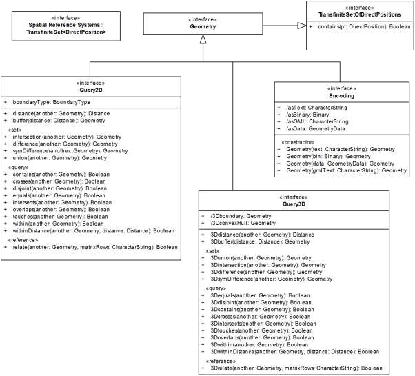
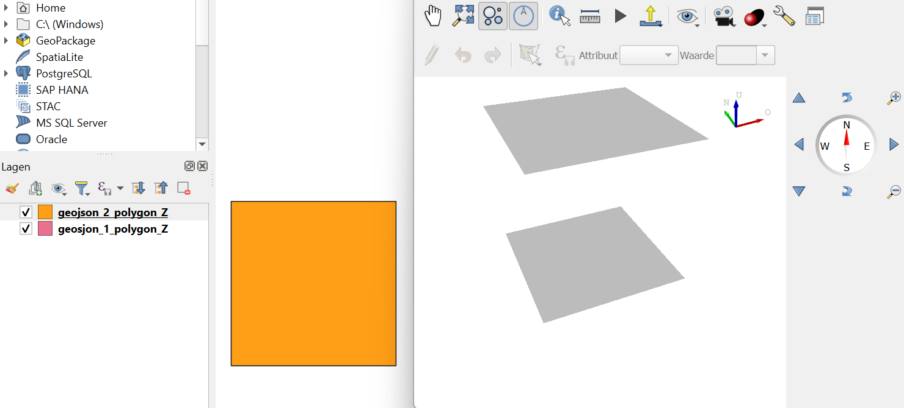

# Geometrische inbedding en Co-dimensie
Een geometrie met een bepaalde topologische dimensie (dimX) kan in elke n-dimensionale ruimte bestaan, zolang geldt: n ≥ dimX. 

Stel men heeft een lijn in 1D, dan kan men die in 2D zetten door een '0' aan het coordinaat toe te voegen. 

x wordt dan (x,0)

Hiermee verandert men de ruimte, niet het object zelf. De dimensie van het object blijft 1. Dit noemt men embedding, of in het nederlands inbedding. 

Andersom kan niet.

Stel dat men ruimtelijke dimensie verlaagt:

(x,y) wordt dan (x)

Hiermee verandert men de ruimte én men verliest informatie van het object zelf. Het beeld ligt in een lagere-dimensionale ruimte. Dit noemt men projectie. 

Een 0D punt kan bestaan in een 0D, 1D, 2D, 3D, nD ruimte. Andersom kan dat niet. Zo kan een 1D lijn kan niet bestaan in een 0D ruimte aangezien een 0D ruimte bestaat uit één enkel punt. Er is daarmee geen vrijheidsgraag om een lijn te vormen. 
Het verschil tussen de dimensie van de geometrie en de ruimte waarin deze geometrie zich bevindt noemt men de Co-dimensie. Het geeft het aantal onafhankelijke richtingen aan die niet in het object liggen.

De mogelijke topologische relaties hangen af van de de ruimte waarin men werkt en de dimensie van de objecten. 

Voor twee Punten (0D) in een 0D-ruimte is er alleen de topologische relatie Equals die altijd waar is. Alle andere topologische relaties zijn niet mogelijk in deze ruimte. In ruimten met hogere dimensie kunnen twee Punten ook Disjoint zijn.

Tussen twee lijnsegmenten (1D) in een 1D ruimte zijn de topologische relaties disjoint, contains, inside, equal, meet, covers, coveredBy en
overlap mogelijk. Twee lijnsegmenten in een 2D ruimte krijgen ook de mogelijkheid om cross als topologische relatie te hebben. Daarnaast is het mogelijk dat de lijnen parallel zijn. Twee lijnsegmenten in 3D kunnen ook skew zijn (niet snijdend, niet parallel, niet in één vlak).  

Twee gebieden (2D) in een 2D ruimte kunnen de topologische relatie Equals, Disjoint, Contains, Inside, Meet en overlap vertonen. Twee gebieden (2d) in een 3D ruimte kunnen coplanair of niet coplanair zijn. Dit geeft extra mogelijkheden hoe twee gebieden elkaar kunnen snijden of langs elkaar kunnen gaan. 

Twee volumes (3D) kunnen alleen bestaan in 3D ruimte. De standaard topologische relaties als Equals, disjoint, contains, inside, meet, overlap blijven. 

Er zijn twee situaties: 
  A)  nD in een mD ruimte (met m ≥ n)
  B)  oD in een pD ruimte (met p ≥ o)

Als m - n == p - o dan en p ≥ m

Bijvoorbeeld: 

1D in een 2D ruimte 
én 
2D in een 3D ruimte 

Lijn 1: (x,0)
Lijn 2: (x,1)
- ze liggen parallel
- ze snijden elkaar niet
- Disjoint. 

Wanneer geembed naar 3D 
Lijn 1: (x,0,0)
Lijn 2: (x,1,0)

blijven disjoint in 3D

Dus: Stelling 1. - elke topologische relatie X voor situatie A bestaat ook in
situatie B 

(andersom geldt duidelijk niet, disjoint bestaat bijvoorbeeld
niet voor 0D elementen in een 0D ruimte).

hogere dimensie voegt nieuwe mogelijkheden toe
dus sommige relaties kunnen juist extra varianten krijgen, niet alleen behouden blijven.

Voorbeeld:

In 2D kunnen twee lijnen alleen snijden of parallel zijn
In 3D kunnen ze ook “skew” zijn (niet snijden en niet parallel)

Dus de relatie-ruimte wordt rijker, niet alleen gelijk. (Maar dit geldt niet bij inbedding van geometrie) 

Veel topologische eigenschappen blijven behouden als je objecten “meeneemt” naar hogere dimensies, zolang:

de relatieve positie gelijk blijft
geen extra vrijheidsgraden worden gebruikt om iets nieuws te laten gebeuren.

Dit is wat de ook benoemd is in de ISO19107:
"Als alles 2D is, is Query3D eigenlijk niet anders dan Query2D
Het verschil ontstaat pas als objecten echt in 3D leven"

Omdat sommige operaties alleen zin hebben in 3D, zoals:

skew lines
vlakken die elkaar in een lijn snijden
volumetrische relaties

Die bestaan niet in 2D.

REQ. 103 All Geometry objects in a Query3D operation are also of type Query3D.
REQ. 104 For instances of Query3D, "is3D" shall always be TRUE.

In het stuk van Sisi Zlatanova [On 3D Topological Relationships](https://gdmc.nl/publications/2000/3D_topological_relationships.pdf) wordt dit uiteengezet. 

Onderstaand voorbeeld geeft het verschil in mogelijke relaties tussen 2D en 3D weer. Alle relaties in de in aanzicht getekende platte vlakken zijn mogelijk in 2D en 3D. Alle in 3D getekende relaties zijn alleen mogelijk in 3D. 

Wanneer er (2D) achter staat, dan is het ook in 3D (embed). Maar als het in 3D is, dan is het niet perse zo in 2D (projectie).

De relatie is bijvoorbeeld van vlak naar lijn. 

R031 (2D) - Disjoint (2D en 3D)  
R127 - Dit heeft nog geen topologische relatie.  
R223 (2D) - Inside  
R287 (2D) - Touch  
R375  - Dit heeft geen topologische relatie.  
R439 - Covers?  
R055 - Geen topologische relatie.  
R159 - Crosses  
R243 (2D)- Crosses?  
R311 - Geen topologische relatie  
R403 (2D) - Equal  
R467 (2D) - CoveredBy  
R063 - Geen topologische relatie   
R179 (2D) - Contains  
R247 (2D) - Crosses?  
R339 (2D) - Dit heeft geen topologische relatie   
R407 - Equal   
R471 (2D) - CoveredBy  
R479 (2D) - CoveredBy  
R095 (2D) - Geen topologische relatie  
R183 - Contains  
R255 (2D) - Crosses?  
R343 (2D) - Geen topologische relatie  
R415 - Equal  
R499 (2D) - Overlaps  
R119 - Geen topologische relatie  
R191 - Contains  
R279 (2D) - Touch  
R351 (2D) - Geen topologische relatie  
R435 (2D) - Covers  
R503 (2D) - Overlaps  

Een topologische analyse in 2D hoeft alleen te analyseren op R179. Terwijl in 3D dit ook moet gebeuren op R183 of R191. 

Stel men heeft Distance tussen twee punten: 

De wiskunde is dan voor twee 2D punten: 

  <math display="block">
    <mi>d</mi>
    <mo>=</mo>
    <msqrt>
      <mrow>
        <msup>
          <mrow>
            <mo>(</mo><msub><mi>x</mi><mn>2</mn></msub>
            <mo>-</mo>
            <msub><mi>x</mi><mn>1</mn></msub><mo>)</mo>
          </mrow>
          <mn>2</mn>
        </msup>
        <mo>+</mo>
        <msup>
          <mrow>
            <mo>(</mo><msub><mi>y</mi><mn>2</mn></msub>
            <mo>-</mo>
            <msub><mi>y</mi><mn>1</mn></msub><mo>)</mo>
          </mrow>
          <mn>2</mn>
        </msup>
      </mrow>
    </msqrt>
  </math>

De wiskunde is dan voor twee 3D punten:

  <math display="block">
    <mi>d</mi>
    <mo>=</mo>
    <msqrt>
      <mrow>
        <msup>
          <mrow>
            <mo>(</mo><msub><mi>x</mi><mn>2</mn></msub>
            <mo>-</mo>
            <msub><mi>x</mi><mn>1</mn></msub><mo>)</mo>
          </mrow>
          <mn>2</mn>
        </msup>
        <mo>+</mo>
        <msup>
          <mrow>
            <mo>(</mo><msub><mi>y</mi><mn>2</mn></msub>
            <mo>-</mo>
            <msub><mi>y</mi><mn>1</mn></msub><mo>)</mo>
          </mrow>
          <mn>2</mn>
        </msup>
        <mo>+</mo>
        <msup>
          <mrow>
            <mo>(</mo><msub><mi>z</mi><mn>2</mn></msub>
            <mo>-</mo>
            <msub><mi>z</mi><mn>1</mn></msub><mo>)</mo>
          </mrow>
          <mn>2</mn>
        </msup>
      </mrow>
    </msqrt>
  </math>

Door de projectie te pakken, de Z-waarde eraf te halen, levert de 2D en 3D berekening exact hetzelfde op. 

Dus een punt (1,1) en een punt (4,5), geembed in 3D dus punt (1,1,0) en een punt (4,5,0). Leveren met de 2D en 3D berekening hetzelfde op. 

Pas als de twee punten echt 3D zijn, zoals het punt (1,1,1) en een punt (4,5,6). Dan geeft de Query3D een ander resultaat.  

Dit is ook wat de ISO ISO19107: "Als alles 2D is, is Query3D eigenlijk niet anders dan Query2D Het verschil ontstaat pas als objecten echt in 3D leven.

De topologie in 3D verandert, de formules die men kan gebruiken veranderen en de algoritmen veranderen. De opeenvolging van analyses die uitgevoerd dienen te worden. 

Twee Polygon Z objecten 

      'POLYGON Z ((0 0 0,10 0 0,10 10 0,0 10 0,0 0 0))'

      en: 

      'POLYGON Z ((0 0 10,10 0 10,10 10 10, 0 10 10,0 0 10))'

De vraag is, zijn deze disjoint? 

Deze twee vlakken zijn in een 2D ruimte niet disjoint. Want de Z waarde wordt genegeerd.

Deze twee vlakken zijn in een 3D ruimte met Query2D niet disjoint. Want de Query2D functie gaat uit van een projectie van geometrie. 

Deze twee vlakken zijn in een 3D ruimte met Query3D wel disjoint. 

De definitie van Disjoint is daarmee niet anders voor 2D als dat het is voor 3D. Namelijk, geometrie A deelt geen enkel punt met geometrie B. 

A ∩ B = ∅

Maar met de Query2D functie in de 3D ruimte kan dit verwarrend zijn 

      'POLYGON Z ((0 0 0,10 0 0,10 10 0,0 10 0,0 0 0))'

      en: 

      'POLYGON Z ((0 0 10,10 0 10,10 10 10, 0 10 10,0 0 10))' delen geen enkel punt. 

De geprojecteerde versie hiervan delen alle punten. 

      'POLYGON ((0 0,10 0,10 10,0 10,0 0))'

      en: 

      'POLYGON ((0 0,10 0,10 10,0 10,0 0))'

Wanneer 

<figure id="Query2D en Query3D">
      
    <figcaption><a class="self-link" href="#fig-Binnen-buiten-grens-van-geometrie"></bdi></a>Query2D en Query3D van Disjoint</figcaption>
</figure>

Query2D test disjointheid in de 2D projectieruimte van de geometrieën, niet in de originele 3D Euclidische ruimte.

Query2D is een computationele procedure die de topologische relatie tussen geometrieën bepaalt in de geprojecteerde 2D ruimte, niet in de oorspronkelijke 3D ruimte.

geometrieën (3D)  
&nbsp;&nbsp;&nbsp;&nbsp;&nbsp;&nbsp;&nbsp;&nbsp;&nbsp;&nbsp; ↓  
projectiefunctie P  
&nbsp;&nbsp;&nbsp;&nbsp;&nbsp;&nbsp;&nbsp;&nbsp;&nbsp;&nbsp; ↓   
2D geometrieën  
&nbsp;&nbsp;&nbsp;&nbsp;&nbsp;&nbsp;&nbsp;&nbsp;&nbsp;&nbsp; ↓  
topologische operator (Disjoint / Intersects / etc.)  
&nbsp;&nbsp;&nbsp;&nbsp;&nbsp;&nbsp;&nbsp;&nbsp;&nbsp;&nbsp; ↓  
boolean resultaat  

Dit is de Query2D functionaliteit. 

Het concept “disjoint” blijft wiskundig onveranderd, maar de betekenis van een disjoint-query wordt bepaald door de ruimte waarin de geometrieën worden geëvalueerd (bijvoorbeeld 2D-projectie vs 3D-ruimte).

Het zou mooi zijn als je zou vragen: Zijn Geometrie A en B Disjoint? (Query3D)

Dat de reactie zou zijn: 
Ja 

Het zou mooi zijn als je zou vragen: Zijn Geometrie A en B Disjoint in projectie? (Query2D)

Dat de reactie dan zou zijn: 
Nee

Wanneer het gaat om twee echt 3D geometrieen. 

En dat als je dat in een 2D omgeving zou vragen: Zijn Geometrie A en B Disjoint? (Query2D)

dat de reactie dan zou zijn: 

Deze vraag is niet mogelijk in een 2D-omgeving vanwege 3D geometrie. 
Voor de projectie geldt: 
Ja

Conclusie: De definitie van Disjoint is niet anders in 2D dan in 3D. Disjoint functies zijn wel anders in 2D dan in 3D. 