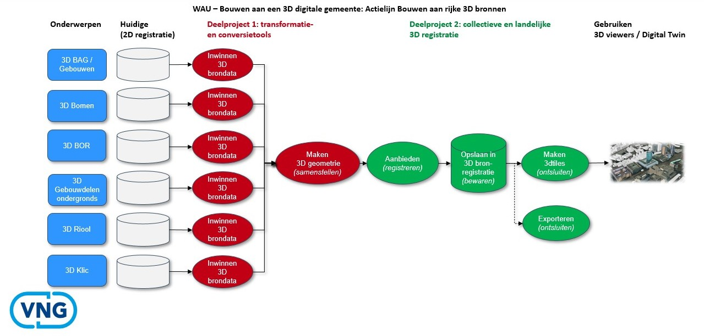

# Introductie

Dit document beschrijft het vervolgonderzoek op de door Geonovum gemaakte Wegwijzer 3D standaarden [[ww3d]], uit maart 2025, voor de uitwisseling van 3D data. In deze wegwijzer is een aantal vervolgstappen beschreven. Eén van die stappen was om een vervolgonderzoek uit te voeren naar standaarden voor de 3D geometrie van fysieke en virtuele objecten conform NEN 3610. 

Dit rapport beschrijft het vervolgonderzoek, waarvan het doel was om te onderzoeken welke geostandaarden nu precies nodig zijn om de basisregistraties in 3D in te winnen, op te slaan, 3D BIM modellen in bestaande topografie in te kunnen passen, en 3D data uit te wisselen en te bekijken. In de Wegwijzer 3D standaarden is al een inventarisatie van 3D standaarden opgenomen. Er blijken verschillende 3D standaarden te zijn, die aansluiten bij verschillende onderdelen van de keten van inwinning naar gebruik. Deze 3D standaarden moeten per ketenonderdeel benoemd worden als geldende standaard in Nederland. In sommige gevallen zijn er meerdere standaarden kandidaat voor één onderdeel van de keten. Een belangrijk doel is daarom ook om te komen tot onderbouwde keuzes als er meer dan één mogelijkheid is. 

In het vervolgonderzoek stonden vijf onderzoeksvragen centraal:

1.	Voor welke soorten objecten en daarmee samenhangende datasets zou deze 3D standaard moeten gelden? (hoofdstuk [[[#objecttypen]]]);
1.	Welke nationale en internationale standaarden vormen de basis voor de eisen aan een 3D object in een basisregistratie en welke aanvullende afspraken maken we op het gebied van semantiek, geometrie, CRS, maar met name inwinning, kwaliteit, detailniveau en afbakening van 3D objecten, rekening houdend met de aansluiting op BIM standaarden? (hoofdstuk [[[#inventarisatie-3d-standaarden]]] );
1.	Welke afspraken zijn nodig om geo-informatie naar BIM, en BIM informatie naar GEO te kunnen krijgen? (hoofdstuk [[[#afspraken-voor-geo-bim]]]);
1.	In welke vorm(en) is implementatieondersteuning nodig voor succesvolle implementatie van de 3D standaard? (handreikingen, software, etc.);
1.	Wordt de 3D standaard wettelijk verplicht of komt deze op de pas-toe-leg-uit lijst?

Vraag 1, 2, en 3 worden in dit rapport behandeld. Vraag 4 en 5 komen in een later stadium aan bod. 

## Werkdoel

Onze opdracht was: 
> "enerzijds om te kijken wat de geostandaarden zijn die benodigd zijn om de basisregistraties in 3D in te winnen, op te slaan en uit te wisselen en anderzijds om te kijken welke geostandaard nodig is om 3D BIM modellen in te kunnen passen in bestaande topografie voor ontwerp en planningsvraagstukken."

Om het vervolgonderzoek goed te kunnen uitvoeren, was het nodig het doel van de nieuwe 3D standaard (of set standaarden) gedetailleerder te beschrijven. Dit noemen we ons werkdoel. Als werkdoel hanteerden we: 

**Het doel van de 3D standaard is om te zorgen voor interoperabiliteit van landelijke 3D bestanden, zodat 3D viewers en digitale tweelingen hieruit op gestandaardiseerde wijze kunnen putten voor zowel visualisaties van 3D modellen als het gebruik van 3D modellen voor analyses en berekeningen.**

De volgende illustratie van de VNG heeft ons geholpen het werk in beeld te krijgen: 

<figure>
    
    <figcaption>De 3D keten in samenhang - bron VNG</figcaption>
</figure>

In deze illustratie zien we een weergave van de 3D keten, lopend van huidige 2D registraties tot aan gebruik van 3D data in viewers en digitale tweelingen. 

In deze keten spelen op meerdere plekken standaarden een rol en hebben wij dus een taak om deze standaarden te definiëren: 

Bij **inwinnen 3D brondata**. Het gaat dan om ruwe data die als basis van 3D modellen dienen, zoals LiDAR data, luchtfoto's, oblieke foto's, maar ook BIM modellen (geen ruwe data maar wel brondata). De Wegwijzer 3D Standaarden geeft voor de ruwe data al handvaten. Aan GeoBIM standaarden wordt momenteel gewerkt in parallele trajecten. 

- **Taak**: afspreken welke standaard(en) we in Nederland gebruiken voor ruwe data, zodat inwinnende bronhouders deze standaarden in hun bestek kunnen opnemen voor opdrachten. 
- **Taak**: de afspraken voor BIM + Geo vastleggen.

Bij **aanbieden / registreren**. Het gaat dan om *uitwisseling en opslag* van 3D vectordata. Uit de Keuzehulp 3D standaarden blijkt dat CityGML hier de beste kandidaat is. 

- **Taak**: deze keuze verder uitwerken met afspraken voor Nederland.

Bij **gebruiken / ontsluiten**. Het gaat dan om 3D *visualisatie* en om *exporteren*. Voor 3D *visualisatie* hebben we twee goedgekeurde internationale standaarden, 3D Tiles en i3s.

- **Taak**: hier een beargumenteerde keuze in maken zodat we voor Nederland één standaard afspreken.

De standaard voor *exporteren* kan dezelfde zijn als voor uitwisseling en opslag (het vorige punt).

## Scope
Onze opdracht had een brede focus:
> "De 3D geometrie van fysieke en virtuele objecten conform NEN 3610"

Onze eerste stap is geweest om na te denken over de soorten objecten waarvoor de overstap naar volledige 3D registratie de meeste meerwaarde zou hebben. Al snel besloten we om eerst te focussen op reële (fysieke) objecten. Deze beperkte focus is nodig om in beperkte tijd de eerste stappen naar een 3D standaard te kunnen zetten.

Wat betreft **soorten objecten** en datasets waar de 3D standaard voor gaat gelden, richten we ons op objectentypen die nodig zijn om een Digital Twin te beschrijven. Zie hiervoor de use case digital twin (hoofdstuk 3).Een groot aantal objecten die nodig zijn in Digital Twins zijn momenteel geregisteerd in een viertal basisregistraties BAG, BGT, BRO, en KLIC conform de informatiemodellen IMBAG, IMBGT|IMGEO, IMBRO, IMKL.

De 3D-standaard heeft als uiteindelijke scope alle objecttypen die nodig zijn voor de volledige keten van 3D data-inwinning, opslag, integratie van BIM-modellen, en uitwisseling van 3D geografische informatie met gerichte toepassingen in visualisatie en analyse. Voor al deze objecttypen is het wenselijk om een 3D-standaard te bepalen. Voorstel is om de uitwerking van deze scope stapsgewijs en iteratief plaats te laten vinden. In iedere iteratie wordt een deel van de objecttypen verder uitgewerkt. Objecttypen die nog niet in een bepaalde iteratie worden behandeld, vallen daarmee niet buiten de scope van de standaard, maar worden op een later moment uitgewerkt. 

In te delen in verschillende iteraties
- iteratie 1: gebouwen en kunstwerken (IMBAG, IMBGT|IMGEO)
- iteratie 2: de bovengrondse stad (IMBGT|IMGEO)
- iteratie 3: de ondergrondse stad (IMKL en IMBRO)

De afweging van de objecttypen over de verschillende iteraties is gebaseerd op twee criteria. Ten eerste is gekeken naar de ervaring en mate van standaardisatie die momenteel al in 3D aanwezig zijn. Ten tweede is beoordeeld hoe relevant het is om het betreffende objecttype in 3D te modelleren. Objecttypen die op beide criteria goed scoren, zijn geselecteerd voor de eerste iteratie. 

De laatste iteraties richten zich op de ondergrond. Dit vormt een logische scheiding, omdat de ondergrond doorgaans niet direct zichtbaar is. Het is visueel minder problematisch wanneer delen van de ondergrond ontbreken dan wanneer er gaten ontstaan in de bovengrondse 3D kaart. Om die reden kan de modellering van de ondergrond als een afzonderlijke vervolgstap worden beschouwd.

In hoofdstuk [[[#objecttypen]]] is deze keuze verder uitgewerkt.

