# 3D objecten

Onderzoeksvraag: *Voor welke soorten objecten en daarmee samenhangende datasets zou deze standaard moeten gelden?*

We kijken naar twee use cases die vooral focussen op de SOLL situatie en antwoord geven op de vraag wat is er nodig aan standaarden om naar die SOLL situatie te komen.

De use cases zijn:

- DTaaS: Digital Twin as a Service. In DTaaS komen diverse use cases aan de orde zoals hittestress en overstroming van steden, waarbij een 3D stadsmodel nodig is om simulaties te kunnen doen. DTaaS maakt gebruik van 3D geo-objecten maar schrijft geen standaard voor. Voor een vergroot gebruik van Digital Twins is een 3D standaard aan te bevelen. Door Digital Twin als usecase te gebruiken versterken we ook de relatie tussen het ZoN Datafundament en het ZoN Digital Twin programma.
- Informatiemodel Geluid. Geluid is bij uitstek een 3D “ding” en heeft ook 3D objecten nodig om binnen de geluidsmodellen te kunnen bepalen welk geluid hoe hard ergens aankomt, gegeven de locatie van de geluidsbron en de fysieke objecten die het geluid onderweg tegenkomt.

## Wat is 3D
In dit document schrijven wij over 3D-objecten. Er zijn verschillende definities van 3D. 

 Topologische dimensie:  Dit is een nummer dat de orthogonale richtingen beschrijft waar een geometrie zich naar uitstrekt. De topologische dimensie kijkt lokaal naar het object, het beschrijft de hoeveelheid onafhankelijke richtingen die er zijn zonder het object te verlaten. Een punt heeft een topologische dimensie van 0. Een rechte lijn een lengte, maar geen breedte of hoogte. De topologische dimensie van een lijn is 1. Een vlak heeft een topologische dimensie van 2. Een kubus heeft topologische dimensie van 3.   

 Coordinaat dimensie:  Deze dimensie beschrijft de hoeveelheid onafhankelijke richtingen die de coordinaten hebben waarmee geometrie is opgebouwd. In theorie kan men, door coördinaten uit te breiden, oneindig veel dimensies bereiken. Veel gebruik zijn de dimensies x, y en z. Maar ook de tijdsdimensie (t) en maat (m) dimensie worden vaak gebruikt. 

 Ruimtelijke dimensie: 
Deze dimensie beschrijft de hoeveelheid onafhankelijke richtingen in de "echte ruimte", die we visueel of fysiek kunnen voorstellen. Dit gaat om de x, y en z dimensie. Dimensies als tijd, maat, druk, temperatuur etc. tellen niet mee.  

De topologische, coordinaat en ruimtelijke dimensies meten elk een ander aspect van een geometrie. 

| Geometrie | Topologische dimensie | Coördinaat- dimensie | Ruimtelijke dimensie | Uitleg | 
| -- | -- | -- | -- | -- | 
| Punt (x,y) | 0D | 2D | 2D | Dit punt strekt zich in 0 richtingen, is beschreven door 2 coördinaten en ligt op een 2D vlak of assenstelsel.  | 
| Lijn (x,y) | 1D | 2D | 2D | Deze lijn strekt zich in 1 richting, is beschreven door 2 coördinaten en ligt op een 2D vlak of assenstelsel. | 
| Vlak (x,y,z) | 2D | 3D | 3D | Dit vlak strekt zich in 2 richtingen, is beschreven door 3 coördinaten en ligt op een 3D vlak of assenstelsel.  | 
| Kubus (x,y,z) | 3D | 3D | 3D | Deze kubus strekt zich in 3 richtingen, is beschreven door 3 coördinaten en ligt op een 3D vlak of assenstelsel.  | 
| Lijn met tijd en maat (x,y,z,t,m) | 1D | 5D | 3D | Deze lijn strekt zich in 1 richting, is beschreven door 5 coördinaten en ligt op een 3D vlak of assenstelsel.  | 
| Punt met een maat (x,y,z,m) | 0D | 4D | 3D | Dit punt strekt zich in 0 richting, is beschreven door 4 coördinaten en ligt op een 3D vlak of assenstelsel.  | 

In dit document focussen wij ons op 3D-objecten waarbij 3D staat voor de ruimtelijke dimensie. 

## Geometrie in 2,5D
Naast de 1D, 2D en 3D ruimtelijke dimensie bestaat er geometrie die men typeert als 2,5D. Hiermee bedoelt men een geometrie die beschreven is door 2 coördinaten, en daarnaast één waarde heeft waarmee de totale geometrie een extra dimensie krijgt. Bijvoorbeeld een vlak geometrie die beschreven is in twee dimensies (x en y) voor alle punten waaruit dit vlak bestaat, kan één hoogte-element als attribuut krijgen waarmee de totale geometrie op hoogte gebracht wordt. Het is daarmee niet mogelijk om de afzonderlijke punten waaruit de geometrie bestaat naar van elkaar afwijkende hoogte te modelleren. Hierom spreekt men ook wel van 2,5D. Dit principe wordt bijvoorbeeld gebruikt in de BGT, waarbij [2D-vlak geometrie](https://docs.geostandaarden.nl/imgeo/catalogus/bgt/#geometrietypen) met het attribuut [relatieveHoogteligging](https://docs.geostandaarden.nl/imgeo/catalogus/bgt/#relatievehoogteligging) op hoogte kan worden gebracht. 

## Topologische relaties 
Een topologische relatie beschrijft hoe objecten ruimtelijk met elkaar verbonden zijn. Ligt iets in, op, naast of over elkaar? Raken objecten elkaar? Of zijn deze gescheiden? 

Om dit geformaliseerd te kunnen duiden en wiskundig te kunnen berekenen zijn standaard topologische modellen beschikbaar. Een belangrijk topologische model dat formeel erkend is door het OGC in de [Simple Feature Access](https://www.ogc.org/standards/sfa/) is het Dimensionally Extended 9–Intersection Model (DE-9IM). 

Het DE-9IM splitst geometrie op in binnen (interior), grens (boundary) en buiten (exterior). Het model voorziet naast 2D vlakken ook in andere dimensies zoals 0D punten, 1D lijnen en 3D volumes. 

<figure id="Binnen-buiten-grens-van-geometrie">
      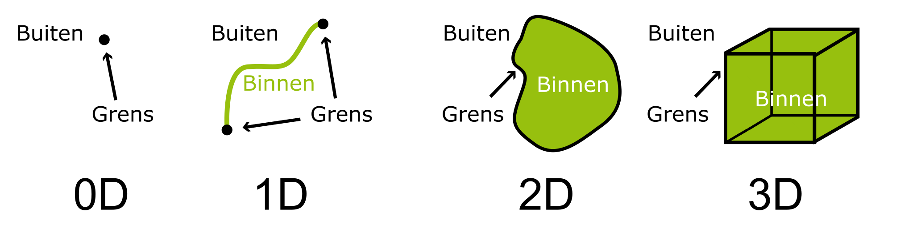
    <figcaption><a class="self-link" href="#fig-Binnen-buiten-grens-van-geometrie"></bdi></a>Binnen, buiten en grens van geometrie</figcaption>
</figure>

De topologische relatie tussen twee geometrieën wordt bepaald door te kijken of en hoe grens, binnen en buiten elkaar snijden. Niet of wel, en als wel met welke dimensie. In het DE-9IM-model wordt de topologische relatie bepaald door de 3×3-matrix van intersecties tussen interieur, grens en exterieur. Een punt heeft geen grens, een lijn heeft een set van eindpunten als grens, een vlak heeft een gesloten lijn als grens en een volume heeft een vlak als grens. 

<figure id="Intersectie_model_2D">
      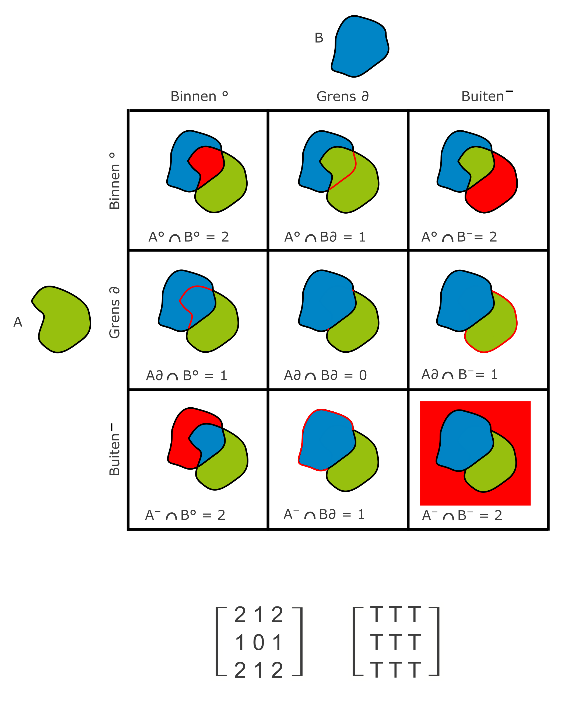
    <figcaption><a class="self-link" href="#fig-Topologische_Relaties_in_2D"></bdi></a>Intersectiemodel van twee 2D vlakken</figcaption>
</figure>

<figure id="Intersectie_model_3D">
      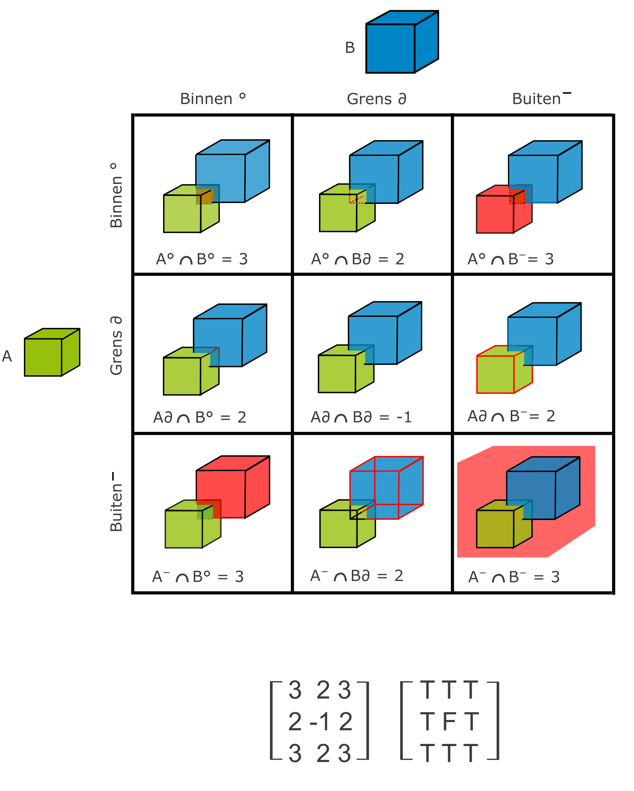
    <figcaption><a class="self-link" href="#fig-Topologische_Relaties_in_3D"></bdi></a>Intersectiemodel van 3D volumes</figcaption>
</figure>

De patronen van de matrix van de intersecties definiëren onderstaande relaties:  

<figure id="Topologische_Relaties_2D_vlakken">
      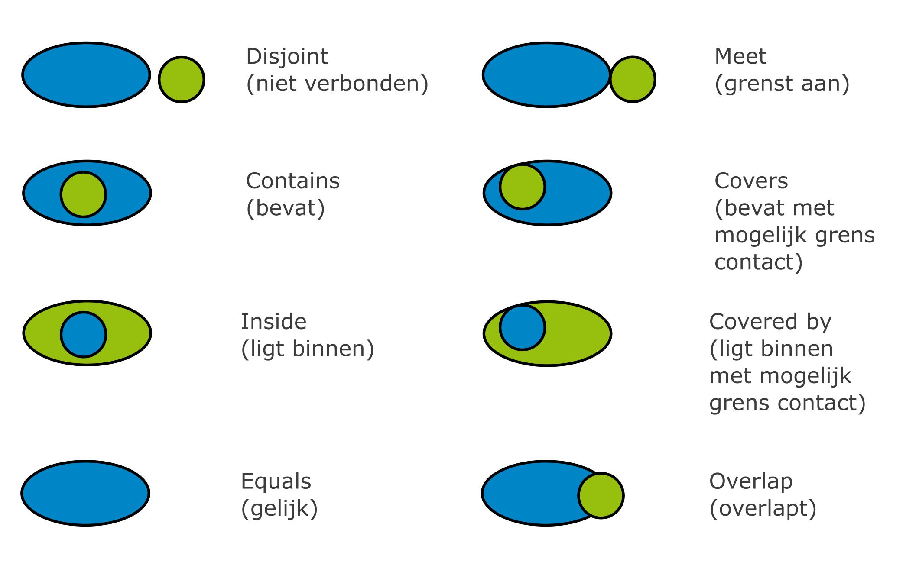
    <figcaption><a class="self-link" href="#fig-Topologische_Relaties_in_3D"></bdi></a>Topologische relatie van twee vlakken</figcaption>
</figure>

De relaties zijn: 
| Egenhofer (DE-9IM): | RCC:| ST | 
|---   | ---- | ---- | 
| Disjoint | DC | Disjoint | 
| Meets/Touches | EC | Touches | 
| Overlaps | PO | Overlaps/intersect | 
| Contains | NTPPi | contains | 
| Within | NTTP | Within | 
| Equal | EQ | Equals |

De ISO 191007 geeft de volgede relaties in hoofdstuk 6.4.8.8: 

<table>
  <tr>
    <th>2D</th>
    <th>3D</th>
  </tr>
  <tr>
    <td colspan="2">Omhulling</td>
  </tr>
  <tr>
    <td>boundaryType</td>
    <td>3DBoundary</td>
  </tr>
    <tr>
    <td colspan="2"><strong>Set</strong></td>
  </tr>
  <tr>
    <td>intersection</td>
    <td>3Dintersection</td>
  </tr>
  <tr>
    <td>difference</td>
    <td>3Ddifference</td>
  </tr>
  <tr>
    <td>symDifference</td>
    <td>3DsymDifference</td>
  </tr>
  <tr>
    <td>union</td>
    <td>3Dunion</td>
  </tr>
  <tr>
    <td colspan="2"><strong>query</strong></td>
  </tr>
  <tr>
    <td>contains</td>
    <td>3Dcontains</td>
  </tr>
  <tr>
  <td>crosses</td>
    <td>3Dcrosses</td>
  </tr>
  <tr>
  <td>disjoint</td>
    <td>3Ddisjoint</td>
  </tr>
  <tr>
  <td>equals</td>
    <td>3Dequals</td>
  </tr>
  <tr>
  <td>intersects</td>
    <td>3Dintersects</td>
  </tr>
  <tr>
  <td>overlaps</td>
    <td>3Doverlaps</td>
  </tr>
  <tr>
  <td>touches</td>
    <td>3Dtouches</td>
  </tr>
  <tr>
  <td>within</td>
    <td>3Dwithin</td>
  </tr>
  <tr>
  <td>withinDistance</td>
    <td>3DwithinDistance</td>
  </tr>
  <tr>
    <td colspan="2"><strong>Omhulling</strong></td>
  </tr>
  <tr>
  <td>relate</td>
    <td>3Drelate</td>
  </tr>
</table>

De NEN3610 verwijst naar de OGC Simple Features Acces standaard een definieert: 

- equals 
- disjoint 
- intersects 
- touches
- crosses
- within
- contains 
- overlaps

Deze relaties zijn in de simple features access formeel gedefinieerd voor 2D‑geometrieën. Het mogelijk om de intersectierelaties toe te passen in 3D. Dit ziet er als volgt uit: 

<figure id="Topologische_Relaties_3D_volumes">
      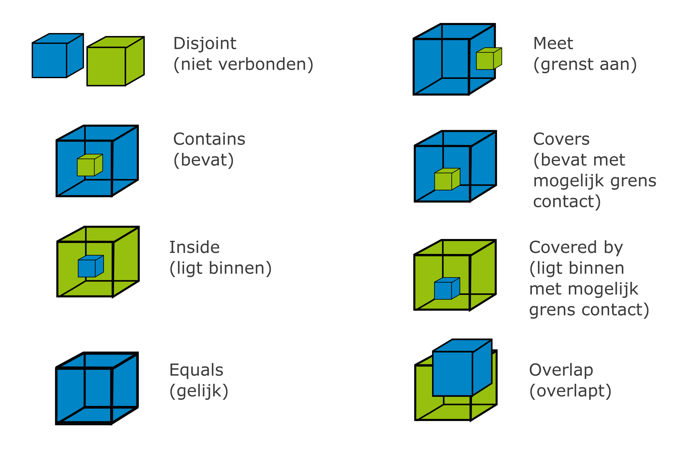
    <figcaption><a class="self-link" href="#fig-Topologische_Relaties_in_3D"></bdi></a>Topologische relatie van twee 3D volumes</figcaption>
</figure>

Het combineren van verschillende dimensies 3D geometrieën bij het analyseren van topologische relaties is een uitdaging. In een beschrijving van een uitbreiding van het RCC-8 en DE 9IM model[RCC-9 and CBM](https://www.researchgate.net/publication/267213170_RCC-9_and_CBM)
en [extension of RCC*-9 to complex and three-dimensional features and its reasoning system](https://www.mdpi.com/2220-9964/13/1/25#Definition_of_RCC9) wordt hiervoor een oplossing geschetst. 

De relatie "Overlaps" had als definitie: de twee regio's delen een gemeenschappelijk deel, maar zijn niet elkaars subset. In de RCC*9, omdat daar ook lijnen, punten en volumes in meegenomen kunnen worden, wordt dit ingewikkelder. Twee vlakken die een gemeenschappelijk deel hebben, overlappen sowieso. Maar bij twee lijnen hoeft dit niet persé een overlap te zijn. Dit kan ook een Cross, "kruist", relatie zijn. Ook een punt op een lijn gaf de vraag of dit een Overlap of External Connect relatie moet zijn. Dit is opgelost. 

<mark> De simple features volgt dit volgens mij niet! </mark>

Wanneer men werkt met Simple Features  wordt het vaak op 3D-gegevens gebruikt door de geometrie in 2D te projecteren, maar dit betekent dat sommige 3D-topologische nuances (zoals “boven/op elkaar” in de Z-richting) niet worden gemodelleerd.

<figure id="3D_vs_2D_geometrie_disjoint_vs_overlap">
      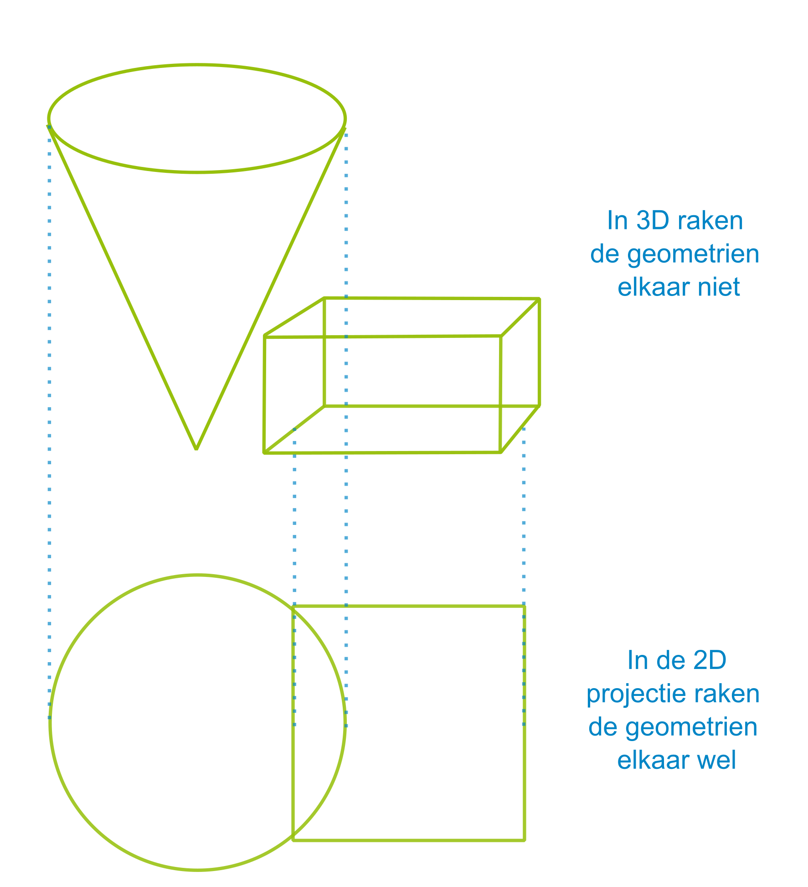
    <figcaption><a class="self-link" href="#fig-3D_vs_2D_geometrie_disjoint_vs_overlap"></bdi></a>3D vs 2D project Disjoint vs Overlap"</figcaption>
</figure>

<mark> Simple Features Part 1 6.1.2.5 frament uit de Simple Features Acces: (Spatial operations work in the "map geometry" of the data and will therefore not reflect z or m values in calculations (e.g., Equals, Length) or in generation of new geometry values (e.g., Buffer, ConvexHull, Intersection). 
This is done by projecting the geometric objects onto the horizontal plane to obtain a "footprint" or "shadow" of the objects for the purposed of map calculations. In other words, it is possible to store and obtain z (and m) 
coordinate values but they are ignored in all other operations which are based on map geometries. 
Implementations are free to include true 3D geometric operations, but should be consistent with ISO 19107.. ) 

En: 

Simple Features Part 1 6.1.15
The relational operators are Boolean methods that are used to test for the existence of a specified topological 
spatial relationship between two geometric objects as they would be represented on a map. Topological spatial 
relationships between two geometric objects have been a topic of extensive study; see References in the 
Bibliography numbered [4], [5], [6], [7], [8], [9], and [10]. The basic approach to comparing two geometric objects 
is to project the objects onto the 2D horizontal coordinate reference system representing the Earth's surface, and 
then to make pair-wise tests of the intersections between the interiors, boundaries and exteriors of the two 
projections and to classify the map relationship between the two geometric objects based on the entries in the 
resulting 3 by 3 ‘intersection’ matrix. The concepts of interior, boundary and exterior are well defined as sets of 
point geometry, and abstracted in general topology; see Reference [4]. 
It is important to note that the calculation of the following operations will give equivalent results whether the 
calculations are done using classical geometric representations or these same calculations are done with 
algebraic techniques in a well-structured and properly defined equivalent topological structure. 
These concepts are applied in this standard for defining spatial relationships between 2-dimensional objects in 2-
dimensional space (ℜ2) by the projection of the objects onto the horizontal surface usually represented in a map. 
This will give a different result than would be obtained if the full 3D geometry (or its corresponding 3D topology) 
because of the changes induced in the projection of the objects onto the horizontal map projection. It would be 
possible to define a full 3D set of operations, but the increase in computational complexity can be prohibitive to 
most implementations, and is generally not supported in many geographic information systems or other 
applications dealing with significant volumes of "mapping data." Specification of full 3D operators following this 
same pattern for higher dimensions is reserved for a future version of this standard.
</mark>

<mark>De topologische regel in de BGT is dat de vlakken op eenzelfde relatieve hoogteligging niet overlappend mogen zijn. Het moet vlakdekkend zijn. Wat gaat dit in de 3D geometriën betekenen?</mark> 

<mark> In de software is het volgende beschikbaar. Nog onderzoeken </mark>

[ST_3DIntersects](https://postgis.net/docs/ST_3DIntersects.html)
Zie [PostGIS 3D Functions](https://postgis.net/workshops/postgis-intro/3d.html)

De vraag is of er voldoende betekenis te geven is met deze 3D-topologische relaties. 

Onderstaande voorbeelden kennen allen de topologische relatie "Meet/Touches (grenst aan)"

<figure id="Topologische_Relatie_3D_grenst_aan">
      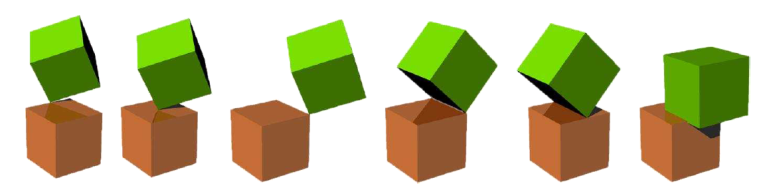
    <figcaption><a class="self-link" href="#fig-Topologische_Relaties_in_3D"></bdi></a>Zes voorbeelden van een zelfde topologische relaties "grenst aan"</figcaption>
</figure>

Stel we hebben onderstaande situatie: 

<figure id="3D_Infrastructureel_werk">
      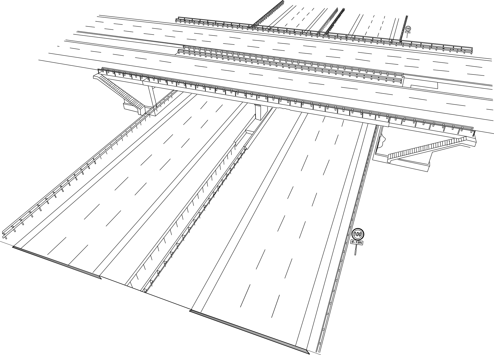
    <figcaption><a class="self-link" href="#fig-3D_Infrastructureel_werk"></bdi></a>Een voorbeeld model van een viaduct over een snelweg"</figcaption>
</figure>

Dit kunnnen we zowel uitdrukken in IFC als in CityGML:

<figure id="3D_Infrastructureel_werk_CityGML">
      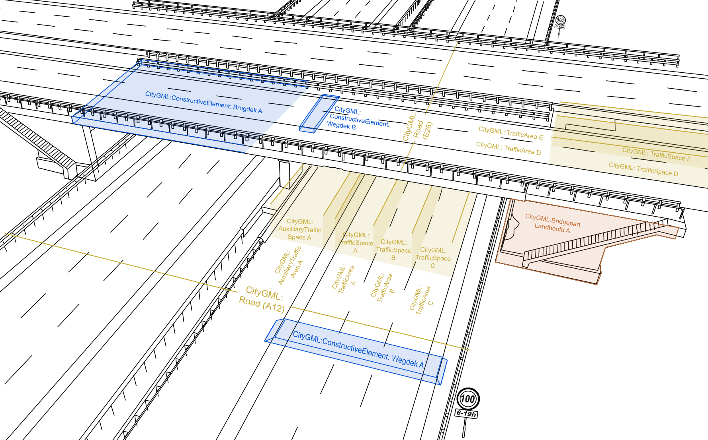
    <figcaption><a class="self-link" href="#fig-3D_Infrastructureel_werk_CityGML"></bdi></a>CityGML-concepten waarmee men een model van een viaduct over een snelweg kan modelleren"</figcaption>
</figure>

De structuur zou dan zijn: 

- `CityGML:Bridge`: **Viaduct Cattenbroekerdijk**
  - `CityGML:BridgePart`: Overspanning
    - `CityGML:ConstructiveElement`: Brugdek A
    - `CityGML:ConstructiveElement`: …
  - `CityGML:BridgePart`: Landhoofd A
    - `CityGML:ConstructiveElement`: Oplegconstructie A
    - `CityGML:ConstructiveElement`: …

- `CityGML:Road`: **A12**
  - `CityGML:TrafficSpace`: A
    - `CityGML:TrafficArea`: A
  - `CityGML:TrafficSpace`: B
    - `CityGML:TrafficArea`: B
  - `CityGML:TrafficSpace`: C
    - `CityGML:TrafficArea`: B
  - `CityGML:ConstructiveElement`: Wegdek

- `CityGML:Road`: **E25**
  - `CityGML:TrafficSpace`: D
    - `CityGML:TrafficArea`: D
  - `CityGML:TrafficSpace`: E
    - `CityGML:TrafficArea`: E
  - `CityGML:ConstructiveElement`: Wegdek B

In IFC is dit heel vergelijkbaar: 

<figure id="3D_Infrastructureel_werk_IFC">
      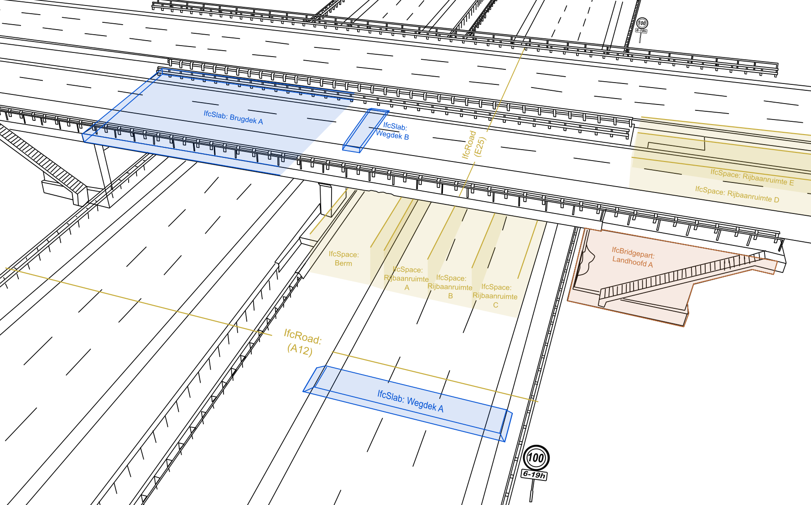
    <figcaption><a class="self-link" href="#fig-3D_Infrastructureel_werk_IFC"></bdi></a>IFC-concepten waarmee men een model van een viaduct over een snelweg kan modelleren"</figcaption>
</figure>

- `IfcBridge`: **Viaduct Cattenbroekerdijk**
  - `IfcBridgePart`: Overspanning
    - `IfcSlab`: Brugdek A
    - `IfcBeam`: …
  - `IfcBridgePart`: Landhoofd
    - `IfcSlab`: Oplegconstructie
    - `IfcPile`: …

- `IfcRoad`: **A12**
  - `IfcRoadPart`: Rijrichting A
    - `IfcSlab`: Wegdek A
    - `IfcSpace`: Rijbaanruimte A
    - `IfcSpace`: Rijbaanruimte B
    - `IfcSpace`: Rijbaanruimte C

- `IfcRoad`: **E25**
  - `IfcRoadPart`: Rijrichting B
    - `IfcSlab`: Wegdek B
    - `IfcSpace`: Rijbaanruimte D
    - `IfcSpace`: Rijbaanruimte E

Topologie:
Relaties, onafhankelijk van rotatie, schaal, en translatie.
<figure id="3D_Infrastructureel_werk_Topologisch_2D">
      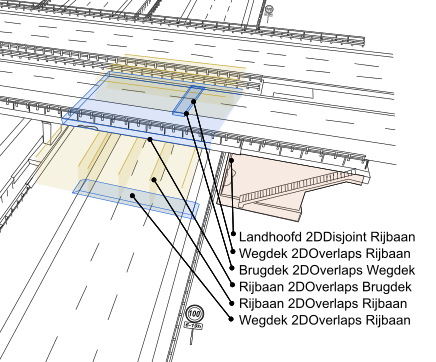
    <figcaption><a class="self-link" href="#fig-3D_Infrastructureel_werk_Topologisch_2D"></bdi></a>Topologisch 2D spatial operators voor een 3D model"</figcaption>
</figure>

<figure id="3D_Infrastructureel_werk_Topologisch_3D">
      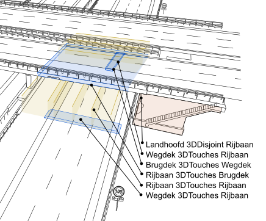
    <figcaption><a class="self-link" href="#fig-3D_Infrastructureel_werk_Topologisch_3D"></bdi></a>Topologisch 3D spatial operators voor een 3D model"</figcaption>
</figure>

Relatieve locatie: 
[Reloc ontology](https://annegoebels.github.io/reloc/)

Geometrie:

<figure id="drie_benaderingen_IFC_geometrie">
      
      <figcaption>
        <a class="self-link" href="#fig-drie_benaderingen_IFC_geometrie"></bdi></a>
        
        Drie verschillende benaderingen soorten geometrie in IFC   
        bron:
        <a href="https://resolver.tudelft.nl/uuid:31380219-f8e8-4c66-a2dc-548c3680bb8d" target="_blank">Automatic generation of CityGML LoD3 building models from IFC models</a> S. Donkers
        
      </figcaption>
</figure>

Mapping naar een BREP model: 

Je ziet dat zeker de modellen met procedurale geometrie in bestandformaat een stuk groter worden. Met als toppunt het tabel_chairs model dat 69 maal zo groot is in GeoJSON al in IFC. 

| model | Bestandsgrootte IFC (KB) | Bestandsgrootte GeoJSON 1:1 mapping (KB)*|  
|-|-|-|
| A20 Corridor    | 7.787     | 2.094  |   
| aisc_sculpture_param    | 314   | 4.206 |   
| ifcbridge-model01 | 14.817  | 26.049 |    
| ifcbridge-model04 | 55  | 296 |    
| ifcbridge-model05 | 25 | 205 | 
| tabel_chairs | 705 | 48.641 |
| kievitsweg_R25 | 13.706 | 65.386 |

