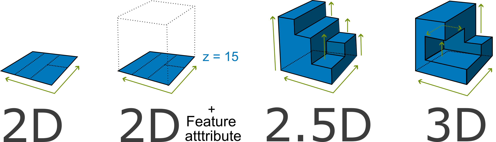
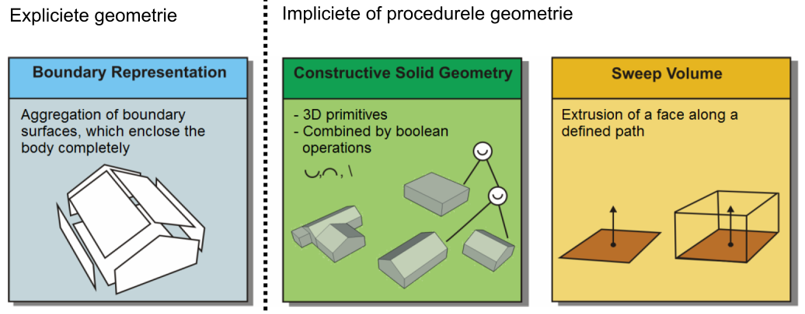

# 3D objecten

Onderzoeksvraag: *Voor welke soorten objecten en daarmee samenhangende datasets zou deze standaard moeten gelden?*

We kijken naar twee use cases die vooral focussen op de SOLL situatie en antwoord geven op de vraag wat is er nodig aan standaarden om naar die SOLL situatie te komen.

De use cases zijn:

- DTaaS: Digital Twin as a Service. In DTaaS komen diverse use cases aan de orde zoals hittestress en overstroming van steden, waarbij een 3D stadsmodel nodig is om simulaties te kunnen doen. DTaaS maakt gebruik van 3D geo-objecten maar schrijft geen standaard voor. Voor een vergroot gebruik van Digital Twins is een 3D standaard aan te bevelen. Door Digital Twin als usecase te gebruiken versterken we ook de relatie tussen het ZoN Datafundament en het ZoN Digital Twin programma.
- Informatiemodel Geluid. Geluid is bij uitstek een fenomeen dat beïnvloed wordt door de 3D ruimte en men heeft 3D objecten nodig om binnen de geluidsmodellen te kunnen bepalen welk geluid hoe hard ergens aankomt, gegeven de locatie van de geluidsbron en de fysieke objecten die het geluid onderweg tegenkomt.

## Wat is 3D
Dit rapport beschrijft 3D-objecten. In de praktijk zijn er verschillende interpretaties van het concept *3D*. Om in dit rapport eenduidig hiermee om te gaan hanteert dit rapport voor 3D onderstaande begrippen. Deze zijn in lijn met de internationale standaard voor geometrie [[ISO19107]]. 

 Geometrische dimensie: 
Dit is een nummer dat de orthogonale richtingen beschrijft waar een geometrie zich naar uitstrekt. De geometrische dimensie kijkt lokaal naar het object, het beschrijft de hoeveelheid onafhankelijke richtingen die er zijn zonder het object te verlaten. Een punt heeft een geometrische dimensie van 0. Een rechte lijn een lengte, maar geen breedte of hoogte. De geometrische dimensie van een lijn is 1. Een vlak heeft een geometrische dimensie van 2. Een kubus heeft een geometrische dimensie van 3.   

 Coördinaat dimensie:  Dit is het aantal onafhankelijke numerieke componenten dat nodig is om een positie in een GIS-representatie te beschrijven.Deze dimensie beschrijft de hoeveelheid onafhankelijke richtingen die de coördinaten hebben waarmee geometrie is opgebouwd. De Simple Feature Access [[SFA]] definieert coördinaat dimensie als de hoeveelheid metingen of assen die nodig zijn om een positie in een coördinaatsysteem te duiden. Veel gebruikt zijn de dimensies x, y en z. Maar ook de tijdsdimensie (t) en maat (m) dimensie worden vaak gebruikt. Andere parametrische dimensies als Kosten, Temperatuur, Druk, Windsnelheid kunnen use-case afhankelijk worden toegevoegd. In theorie kan men, door coördinaten uit te breiden, oneindig veel dimensies bereiken.

coördinaten beschrijven verschillende dimensies. De x,y en z coördinaat beschrijven de ruimtelijke dimensie, terwijl een temporele coördinaat een aparte temporele dimensie beschrijft die geen onderdeel is van de ruimtelijke dimensie. Parametrische coördinaten beschrijven weer een andere dimensie. 

 Ruimtelijke dimensie: 
Deze dimensie beschrijft de hoeveelheid onafhankelijke richtingen in de "echte ruimte", die we visueel of fysiek kunnen voorstellen. Dit gaat om de x, y en z dimensie. Dimensies als tijd, maat, druk, temperatuur etc. tellen niet mee. Ruimtelijke coördinaten bestaan niet los. Ze zijn altijd gedefinieerd binnen een coordinate reference system (CRS). Ruimtelijke coördinaten dienen consistent te zijn met een CRS beschreven door [[ISO19111]].

 Temporele dimensie  
Temporele coördinaten beschrijven een fenomeen in de tijdsruimte. Dit maakt het mogelijk om bijvoorbeeld geldigheid, volgorde en duur te definiëren. Temporele coördinaten moeten horen bij een Time Reference System (TRS) volgens[[ISO19108]].

 Parametrische dimensie 
Parametrische coördinaten beschrijven de positionering van een fenomeen in een aanvullende dimensie die niet ruimtelijk en niet temporeel van aard is. Parametrische coördinaten zijn geen attributen, maar worden ondersteund door extra assen, naast de ruimtelijke en temporele assen. Parametrische coördinaten dienen consistent te zijn met het uitbreidingsmechanisme beschreven door [[ISO19111]].

Een combinatie van 3D ruimtelijke dimensie met 1D temporele dimensie wordt ook wel 4D of ruimtelijk-temporeel (spatio-temporal) genoemd.   

<table>
  <caption> Tabel met <strong>voorbeelden</strong> die het verschil tussen geometrische, coördinaat- en ruimtelijke, temporele en parametrische dimensies illustreren</caption>
  <thead>
    <tr>
      <th>Geometrie</th>
      <th>Geometrische dimensie</th>
      <th>Coördinaat-dimensie</th>
      <th>Ruimtelijke dimensie</th>
      <th>Temporele dimensie</th>
      <th>Parametrische dimensie</th>
      <th>Uitleg</th>
    </tr>
  </thead>
  <tbody>
    <tr>
      <td>Punt (x,y)</td>
      <td>0D</td>
      <td>2D</td>
      <td>2D</td>
      <td>0D</td>
      <td>0D</td>
      <td>Dit punt strekt zich in 0 richtingen, is beschreven door 2 coördinaten en ligt op een 2D vlak of assenstelsel.</td>
    </tr>
    <tr>
      <td>Lijn (x,y)</td>
      <td>1D</td>
      <td>2D</td>
      <td>2D</td>
      <td>0D</td>
      <td>0D</td>
      <td>Deze lijn strekt zich in 1 richting, is beschreven door 2 coördinaten en ligt op een 2D vlak of assenstelsel.</td>
    </tr>
    <tr>
      <td>Vlak (x,y,z)</td>
      <td>2D</td>
      <td>3D</td>
      <td>3D</td>
      <td>0D</td>
      <td>0D</td>
      <td>Dit vlak strekt zich in 2 richtingen, is beschreven door 3 coördinaten en ligt in een 3D ruimte.</td>
    </tr>
    <tr>
      <td>Kubus (x,y,z)</td>
      <td>3D</td>
      <td>3D</td>
      <td>3D</td>
      <td>0D</td>
      <td>0D</td>
      <td>Deze kubus strekt zich in 3 richtingen, is beschreven door 3 coördinaten en ligt in een 3D ruimte.</td>
    </tr>
    <tr>
      <td>Lijn met tijd en maat (x,y,z,t,m)</td>
      <td>1D</td>
      <td>5D</td>
      <td>3D</td>
      <td>1D</td>
      <td>1D</td>
      <td>Deze lijn strekt zich in 1 richting en is beschreven door 5 coördinaten. Het punt ligt in een 3D ruimte, heeft een tijd en een meting.</td>
    </tr>
    <tr>
      <td>Punt met een maat (x,y,z,m)</td>
      <td>0D</td>
      <td>4D</td>
      <td>3D</td>
      <td>0D</td>
      <td>1D</td>
      <td>Dit punt strekt zich in 0 richtingen, is beschreven door 4 coördinaten. Het punt ligt in een 3D ruimte en heeft een meting</td>
    </tr>
  </tbody>
</table>

In dit document focussen wij ons op 3D-objecten waarbij 3D staat voor de ruimtelijke dimensie waarin objecten met een 0D, 1D, 2D, en 3D geometrische dimensie kunnen bestaan. De ruimtelijke coördinaten dienen consistent te zijn met een CRS beschreven door [[ISO19111]]. De CRS'en waar in deze standaard naar gekeken wordt zijn: 

- RDNAP (EPSG:7415) 
- ETRS89 
- WGS 84
- Engineered CRS

Deze zijn beschreven in de Handreiking Gebruik coördinaatreferentiesystemen bij uitwisseling en visualisatie van geo-informatie [[HRCRS]].

Voor het temporele coördinatenstelsel wordt gebruik gemaakt van de wereldwijd afgesproken UTC (Coordinated Universal Time). [[ISO8601]] voorziet in regels voor de notatie van het tijdscoördinaat.   

## Geometrie in 2D, 2D met hoogte attribuut, 2,5D en 3D
Geo-objecten worden in registraties meestal door middel van een geometrie gerepresenteerd. Dit kan, zoals hierboven uitgelegd, in een 2D of een 3D ruimtelijke dimensie gebeuren. In de praktijk zien we ook enkele vormen die tussen 2D en 3D in zitten.

0D, 1D en 2D-geometrieën in 2D ruimtelijke dimensie kennen geen hoogte. Naast het definieren van geometrie in een 3D-ruimtelijke dimensie bestaan er andere mogelijkheden om 3D-informatie toe te voegen. Men kan hoogte duiden door één of meerdere attributen als "hoogte" aan een feature in een 2D ruimtelijke dimensie te binden. Met deze informatie is het mogelijk om 3D-geometrie in een 3D-ruimtelijke dimensie te construeren. 

Dit principe wordt bijvoorbeeld gebruik in de [3D-Basisvoorziening](https://api.pdok.nl/kadaster/3d-basisvoorziening/ogc/v1/collections/hoogtestatistieken_gebouwen) en de [3D-Basisvoorziening productbeschrijving](https://3d.kadaster.nl/productbeschrijving/#3d-basisvoorziening). Hier kan men de BGT geleverd krijgen, waarbij [2D-vlak geometrie](https://docs.geostandaarden.nl/imgeo/catalogus/bgt/#geometrietypen) met een aantal attributen als "maaiveldhoogte"en "dakhoogte" in 2D kan downloaden. Dit kan een werkwijze zijn voor het creëren van 3D geometrie van gebouwen op verschillende detailniveaus oftewel *levels of detail* (LOD0 tot LOD1.2), zie [Level of Detail framework voor gebouwen](https://3d.bk.tudelft.nl/lod/).Het hoogte attribuut kan in een 2D-systeem gebruikt worden om volume te meten of om weer 3D van te maken. Ook het project Totaal Driedimensionaal heeft hier een werkwijze voor. Zie de [Totaal Driedimensionaal toolkit](https://gemeentelijkgeoberaad.pleio.nl/groups/view/6cde6b9d-4ae2-4951-8888-b4994f4a34a3/3d-implementatie/files/dfba4177-1bb8-4275-a435-a677db94a8e2).

In de praktijk kent men ook 2,5D geometrie. Dit zijn punten, lijnen of vlakken in een 3D-ruimtelijke dimensie. Coördinaten bestaan uit een x,y en z waarde. Er wordt niet over 3D, maar over 2,5D gesproken omdat bij elk x,y-locatie er maximaal één z-waarde beschikbaar is. Dat betekent dat 2D geometrien zich in een 3D ruimte (x,y,z) bevinden maar dat de geometriën zichzelf of elkaar niet mogen overlappen in de horizontale projectie. De definitie hiervan staat beschreven in [geometrie in model en GML](https://docs.geostandaarden.nl/nen3610/gimeg/#definities-van-2-2-5-en-3d). Verticale vlakken zijn hierin ook niet mogelijk. 

Tenslotte bestaat echte 3D geometrie. Dit zijn punten, lijnen, vlakken en volumes. Volume eenheden oftewel ‘solids’ zijn onderdeel van de mogelijke geometrietypen. Bij elke x,y-locatie zijn er meerdere z-waarden mogelijk.

Onderstaand beeld geeft de verschillende opties weer. De verticale vlakken in 2.5D zijn iets naar achter hellend zodat er geen dubbele z-waarde ontstaat.

<figure id="2d-2d-attribuut-2punt5D-en-3D">
      
      <figcaption>
        Verschil tussen de ruimtelijke dimensie 2D, 2D met hooogte attribuut, 2,5D en 3D 
      </figcaption>
</figure>

## Geometrie in 3D
Er zijn verschillende benaderingen voor het definieren van (3D) geometrie. In hoofdlijnen komt dit neer op de volgende groepen: 

<figure id="drie_benaderingen_IFC_geometrie">
      
      <figcaption>
        Drie verschillende benaderingen soorten geometrie in IFC   
        (bron: [[AGCITYGMLIFC]])
      </figcaption>
</figure>

GIS ondersteunt meestal alleen expliciete geometrie, zoals meshes en boundary representations (BRep). IFC ondersteunt zowel expliciete als impliciete geometrie. Naast expliciete meshes en BReps ondersteunt IFC ook geometrie zoals sweeps en constructive solid geometry (CSG). Deze impliciete geometrie maakt het mogelijk om zeer complexe vormen op te slaan in een relatief licht formaat met behulp van wiskundige vergelijkingen. <mark> verwijzing naar onderzoek naar geometrie </mark>

## Topologie in 3D
Het definieren van geometrieën in een 3D ruimtelijke dimensie introduceert nieuwe topologische mogelijkheden die in een 2D ruimtelijke dimensie niet bestaan (zie [On 3D Topological Relationships](https://gdmc.nl/publications/2000/3D_topological_relationships.pdf)). De betekenis van een topologische relatie verandert niet tussen 2D en 3D: je kunt van bijvoorbeeld lijnen, vlakken of volumes stellen, dat ze elkaar "raken", "overlappen" of "disjoint" zijn. 

Het resultaat van een topologische bevraging hangt echter wel af van de dimensie van de ruimte waarin de relatie wordt geëvalueerd. Dat wil zeggen, het *antwoord* op de vraag of twee volumes elkaar raken, of wat de afstand tussen beide is, kan *verschillen afhankelijk van de ruimtelijke dimensie waarin de vraag beantwoord wordt*. 

## Topologie in 3D
Het definieren van geometrieën in een 3D ruimtelijke dimensie introduceert nieuwe topologische mogelijkheden die in een 2D ruimtelijke dimensie niet bestaan (zie [[3DTOPREL]]). De betekenis van een topologische relatie verandert niet tussen 2D en 3D: je kunt van bijvoorbeeld lijnen, vlakken of volumes stellen, dat ze elkaar "raken", "overlappen" of "disjoint" zijn. 

Het resultaat van een topologische bevraging hangt echter wel af van de dimensie van de ruimte waarin de relatie wordt geëvalueerd. Dat wil zeggen, het *antwoord* op de vraag of twee volumes elkaar raken, of wat de afstand tussen beide is, kan *verschillen afhankelijk van de ruimtelijke dimensie waarin de vraag beantwoord wordt*. 

Binnen de Simple Features Access standaard worden relaties van geometrieën in een 3D-ruimtelijke dimensie standaard geëvalueerd in een 2D-projectie. Voor echte 3D-geometrieën in een 3D-ruimtelijke dimensie zijn Query2D en Query3D verschillende operaties. Bij menging van 2D- en 3D-geometrieën moet inbedding of projectie expliciet gebeuren. Zie het document [Zie bureauonderzoek naar geometrie en topologie in 3D](https://geonovum.github.io/3d-standaard-onderzoek/).

Hieruit volgt dat het nodig is, om een set topologische regels voor specifieke 3D-situaties te definieren. Hiervoor is een issue aangemaakt in de NEN3610 GitHub repository <mark>[ref toevoegen]</mark>.
