# 3D objecten

Onderzoeksvraag: *Voor welke soorten objecten en daarmee samenhangende datasets zou deze standaard moeten gelden?*

We kijken naar twee use cases die vooral focussen op de SOLL situatie en antwoord geven op de vraag wat is er nodig aan standaarden om naar die SOLL situatie te komen.

De use cases zijn:

- DTaaS: Digital Twin as a Service. In DTaaS komen diverse use cases aan de orde zoals hittestress en overstroming van steden, waarbij een 3D stadsmodel nodig is om simulaties te kunnen doen. DTaaS maakt gebruik van 3D geo-objecten maar schrijft geen standaard voor. Voor een vergroot gebruik van Digital Twins is een 3D standaard aan te bevelen. Door Digital Twin als usecase te gebruiken versterken we ook de relatie tussen het ZoN Datafundament en het ZoN Digital Twin programma.
- Informatiemodel Geluid. Geluid is bij uitstek een 3D “ding” en heeft ook 3D objecten nodig om binnen de geluidsmodellen te kunnen bepalen welk geluid hoe hard ergens aankomt, gegeven de locatie van de geluidsbron en de fysieke objecten die het geluid onderweg tegenkomt.

## Wat is 3D
In dit document schrijven wij over 3D-objecten. Er zijn verschillende definities van 3D. 

 Topologische dimensie:  Dit is een nummer dat de orthogonale richtingen beschrijft waar een geometrie zich naar uitstrekt. De topologische dimensie kijkt lokaal naar het object, het beschrijft de hoeveelheid onafhankelijke richtingen die er zijn zonder het object te verlaten. Een punt heeft een topologische dimensie van 0. Een rechte lijn een lengte, maar geen breedte of hoogte. De topologische dimensie van een lijn is 1. Een vlak heeft een topologische dimensie van 2. Een kubus heeft topologische dimensie van 3.   

 Coordinaat dimensie:  Deze dimensie beschrijft de hoeveelheid onafhankelijke richtingen die de coordinaten hebben waarmee geometrie is opgebouwd. In theorie kan men, door coördinaten uit te breiden, oneindig veel dimensies bereiken. Veel gebruik zijn de dimensies x, y en z. Maar ook de tijdsdimensie (t) en maat (m) dimensie worden vaak gebruikt. 

 Ruimtelijke dimensie: 
Deze dimensie beschrijft de hoeveelheid onafhankelijke richtingen in de "echte ruimte", die we visueel of fysiek kunnen voorstellen. Dit gaat om de x, y en z dimensie. Dimensies als tijd, maat, druk, temperatuur etc. tellen niet mee.  

De topologische, coordinaat en ruimtelijke dimensies meten elk een ander aspect van een geometrie. 

| Geometrie | Topologische dimensie | Coördinaat- dimensie | Ruimtelijke dimensie | Uitleg | 
| -- | -- | -- | -- | -- | 
| Punt (x,y) | 0D | 2D | 2D | Dit punt strekt zich in 0 richtingen, is beschreven door 2 coördinaten en ligt op een 2D vlak of assenstelsel.  | 
| Lijn (x,y) | 1D | 2D | 2D | Deze lijn strekt zich in 1 richting, is beschreven door 2 coördinaten en ligt op een 2D vlak of assenstelsel. | 
| Vlak (x,y,z) | 2D | 3D | 3D | Dit vlak strekt zich in 2 richtingen, is beschreven door 3 coördinaten en ligt op een 3D vlak of assenstelsel.  | 
| Kubus (x,y,z) | 3D | 3D | 3D | Deze kubus strekt zich in 3 richtingen, is beschreven door 3 coördinaten en ligt op een 3D vlak of assenstelsel.  | 
| Lijn met tijd en maat (x,y,z,t,m) | 1D | 5D | 3D | Deze lijn strekt zich in 1 richting, is beschreven door 5 coördinaten en ligt op een 3D vlak of assenstelsel.  | 
| Punt met een maat (x,y,z,m) | 0D | 4D | 3D | Dit punt strekt zich in 0 richting, is beschreven door 4 coördinaten en ligt op een 3D vlak of assenstelsel.  | 

In dit document focussen wij ons op 3D-objecten waarbij 3D staat voor de ruimtelijke dimensie. 

## Geometrie in 2,5D
Naast de 1D, 2D en 3D ruimtelijke dimensie bestaat er geometrie die men typeert als 2,5D. Hiermee bedoelt men een geometrie die beschreven is door 2 coördinaten, en daarnaast één waarde heeft waarmee de totale geometrie een extra dimensie krijgt. Bijvoorbeeld een vlak geometrie die beschreven is in twee dimensies (x en y) voor alle punten waaruit dit vlak bestaat, kan één hoogte-element als attribuut krijgen waarmee de totale geometrie op hoogte gebracht wordt. Het is daarmee niet mogelijk om de afzonderlijke punten waaruit de geometrie bestaat naar van elkaar afwijkende hoogte te modelleren. Hierom spreekt men ook wel van 2,5D. Dit principe wordt bijvoorbeeld gebruikt in de BGT, waarbij [2D-vlak geometrie](https://docs.geostandaarden.nl/imgeo/catalogus/bgt/#geometrietypen) met het attribuut [relatieveHoogteligging](https://docs.geostandaarden.nl/imgeo/catalogus/bgt/#relatievehoogteligging) op hoogte kan worden gebracht. 

## 3D Topologische relaties 
Een topologische relatie beschrijft hoe objecten ruimtelijk met elkaar verbonden zijn. Ligt iets in, op, naast of over elkaar? Raken objecten elkaar? Of zijn deze gescheiden? 

Om dit geformaliseerd te kunnen duiden en wiskundig te kunnen berekenen zijn standaard topologische modellen beschikbaar. Een belangrijk topologische model dat formeel erkend is door het OGC in de [Simple Feature Access](https://www.ogc.org/standards/sfa/) is het Dimensionally Extended 9–Intersection Model (DE-9IM). 

### DE-9IM
Het DE-9IM splitst geometrie op in binnen (interior), grens (boundary) en buiten (exterior). Het model voorziet naast 2D vlakken ook in andere dimensies zoals 0D punten, 1D lijnen en 3D volumes. 

<figure id="Binnen-buiten-grens-van-geometrie">
      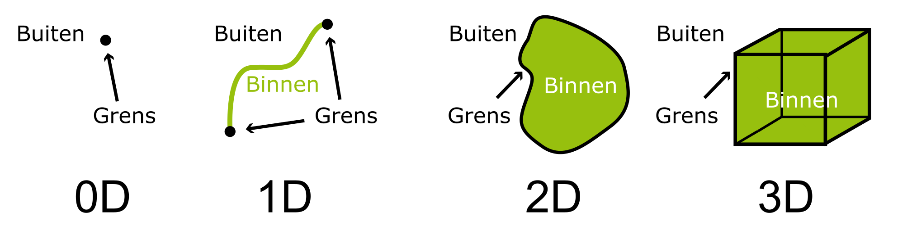
    <figcaption><a class="self-link" href="#fig-Binnen-buiten-grens-van-geometrie"></bdi></a>Binnen, buiten en grens van geometrie</figcaption>
</figure>

De topologische relatie tussen twee geometrieën wordt bepaald door te kijken of en hoe grens, binnen en buiten elkaar snijden. Niet of wel, en als wel met welke dimensie. In het DE-9IM-model wordt de topologische relatie bepaald door de 3×3-matrix van intersecties tussen interieur, grens en exterieur. Een punt heeft geen grens, een lijn heeft een set van eindpunten als grens, een vlak heeft een gesloten lijn als grens en een volume heeft een vlak als grens. 

<figure id="Intersectie_model_2D">
      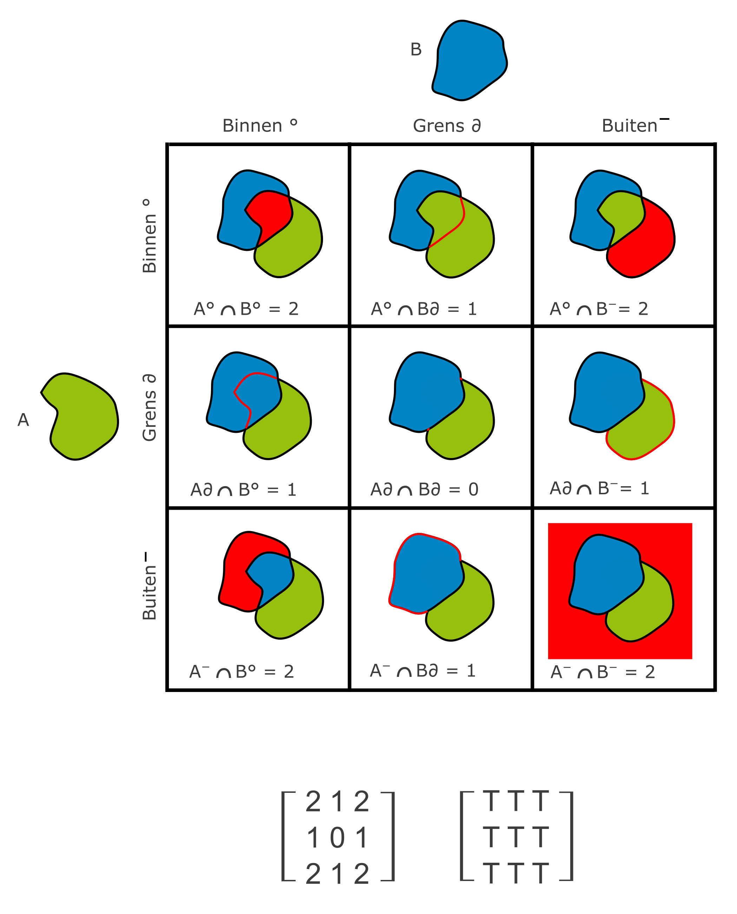
    <figcaption><a class="self-link" href="#fig-Topologische_Relaties_in_2D"></bdi></a>Intersectiemodel van twee 2D vlakken die overlappen</figcaption>
</figure>

<figure id="Intersectie_model_3D">
      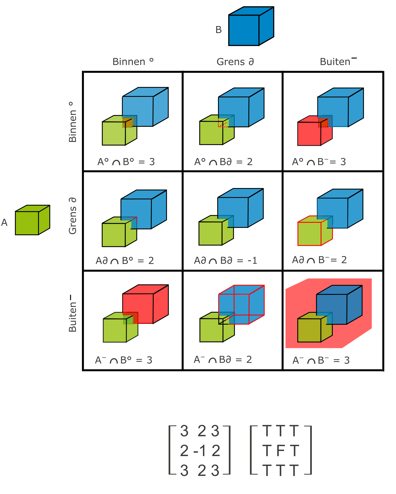
    <figcaption><a class="self-link" href="#fig-Topologische_Relaties_in_3D"></bdi></a>Intersectiemodel van 3D volumes die overlappen</figcaption>
</figure>

De patronen van de matrix van de intersecties definiëren bijvoorbeeld onderstaande relaties:  

<figure id="Topologische_Relaties_2D_vlakken">
      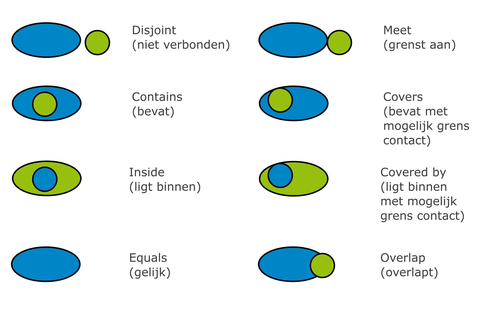
    <figcaption><a class="self-link" href="#fig-Topologische_Relaties_in_3D"></bdi></a>Topologische relatie van twee vlakken</figcaption>
</figure>

<figure id="Topologische_Relaties_3D_volumes">
      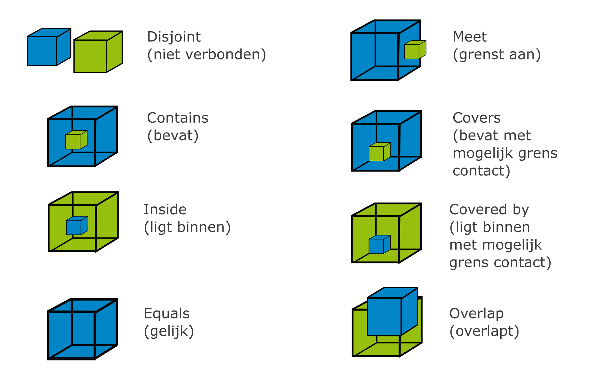
    <figcaption><a class="self-link" href="#fig-Topologische_Relaties_in_3D"></bdi></a>Topologische relatie van twee 3D volumes</figcaption>
</figure>

Deze relaties zijn in de simple features access formeel gedefinieerd voor 2D‑geometrieën Ondanks dat het mogelijk is om de intersectierelaties toe te passen in 3D. 

De namen van de topologische relaties zoals Egenhofer, RCC, ST en NEN3610 kunnen verschillen: 
| Egenhofer (DE-9IM): | RCC:| ST | NEN 3610
|---   | ---- | ---- | --- |
| Disjoint | DC | Disjoint | 
| Meets/Touches | EC | Touches | 
| Overlaps | PO | Overlaps/intersect | 
| Contains | NTPPi | contains | 
| Within | NTTP | Within | 
| Equal | EQ | Equals | equals |

### NEN3610
De NEN3610 verwijst in hoofdstuk 9.12 naar de OGC Simple Features Acces standaard. In de NEN staat: "NEN 3610 volgt hiervoor de OGC Simple Features Access-standaard, waarin het Dimensionally Extended 9-Intersection Model (DE-9IM) wordt gebruikt. De 'spatial predicates' hierin zijn hieronder opgenomen met de Engelse term uit OGC Simple Features Access. Voor de definitie wordt naar die OGC-standaard verwezen." 

De NEN 3610 definieert vervolgens: 

- equals 
- disjoint 
- intersects 
- touches
- crosses
- within
- contains 
- overlaps

### Simple Features Access topologie
Wanneer men werkt met Simple Features  wordt het vaak op 3D-gegevens gebruikt door de geometrie in 2D te projecteren, maar dit betekent dat sommige 3D-topologische nuances (zoals “boven/op elkaar” in de Z-richting) niet worden gemodelleerd.

De Simple Features Access schrijft in Part 1, Hoofdstuk 6.1.2.5: "Spatial operations work in the "map geometry" of the data and will therefore not reflect z or m values in calculations (e.g., Equals, Length) or in generation of new geometry values (e.g., Buffer, ConvexHull, Intersection). This is done by projecting the geometric objects onto the horizontal plane to obtain a "footprint" or "shadow" of the objects for the purposed of map calculations. In other words, it is possible to store and obtain z (and m) coordinate values but they are ignored in all other operations which are based on map geometries. Implementations are free to include true 3D geometric operations, but should be consistent with ISO 19107.."  

Verder in Part 1, hoofdstuk 6.1.15 schrijft de Simple Features Access: "The relational operators are Boolean methods that are used to test for the existence of a specified topological spatial relationship between two geometric objects as they would be represented on a map. Topological spatial relationships between two geometric objects have been a topic of extensive study. The basic approach to comparing two geometric objects is to project the objects onto the 2D horizontal coordinate reference system representing the Earth's surface, and then to make pair-wise tests of the intersections between the interiors, boundaries and exteriors of the two projections and to classify the map relationship between the two geometric objects based on the entries in the resulting 3 by 3 ‘intersection’ matrix. The concepts of interior, boundary and exterior are well defined as sets of point geometry, and abstracted in general topology. It is important to note that the calculation of the following operations will give equivalent results whether the calculations are done using classical geometric representations or these same calculations are done with algebraic techniques in a well-structured and properly defined equivalent topological structure. 
These concepts are applied in this standard for defining spatial relationships between 2-dimensional objects in 2-dimensional space (ℜ2) by the projection of the objects onto the horizontal surface usually represented in a map. 
This will give a different result than would be obtained if the full 3D geometry (or its corresponding 3D topology) because of the changes induced in the projection of the objects onto the horizontal map projection. It would be possible to define a full 3D set of operations, but the increase in computational complexity can be prohibitive to most implementations, and is generally not supported in many geographic information systems or other applications dealing with significant volumes of "mapping data." Specification of full 3D operators following this same pattern for higher dimensions is reserved for a future version of this standard.

De Simple Features Access definieert naast de ruimtelijke relaties ook een aantal analyse methode als: 
- distance 
- buffer
- convexHull
- intersection
- union
- difference 
- symDifference

De definities van ruimtelijke relaties en analyses in 2D en 3D kunnen tot verwarring leiden. Als men 2 3D-geometriën bevraagt op de topologische relatie en het antwoord is "Overlaps" kan het onduidelijk zijn wat hier mee bedoeld wordt. Ook vragen als wat is de "Distance" tussen deze twee geometriën kan verkeerd worden geïnterpreteerd.

<figure id="3D_vs_2D_geometrie_disjoint_vs_overlap">
      
    <figcaption><a class="self-link" href="#fig-3D_vs_2D_geometrie_disjoint_vs_overlap"></bdi></a>3D vs 2D project Disjoint vs Overlap"</figcaption>
</figure>

<figure id="3D_vs_2D_geometrie_distance">
      
    <figcaption><a class="self-link" href="#fig-3D_vs_2D_geometrie_disjoint_vs_overlap"></bdi></a>3D vs 2D project Disjoint vs Overlap"</figcaption>
</figure>

## ISO 191007 
Implementaties zijn volgens de Simple Features Access vrij om 3D topologische relaties en analyses te duiden met de ISO 191007. Deze ISO geeft in hoofdstuk 6.4.8.8 de volgende relaties

<table>
  <tr>
    <th>2D</th>
    <th>3D</th>
  </tr>
  <tr>
    <td colspan="2">Omhulling</td>
  </tr>
  <tr>
    <td>boundaryType</td>
    <td>3DBoundary</td>
  </tr>
    <tr>
    <td colspan="2"><strong>Set</strong></td>
  </tr>
  <tr>
    <td>intersection</td>
    <td>3Dintersection</td>
  </tr>
  <tr>
    <td>difference</td>
    <td>3Ddifference</td>
  </tr>
  <tr>
    <td>symDifference</td>
    <td>3DsymDifference</td>
  </tr>
  <tr>
    <td>union</td>
    <td>3Dunion</td>
  </tr>
  <tr>
    <td colspan="2"><strong>query</strong></td>
  </tr>
  <tr>
    <td>contains</td>
    <td>3Dcontains</td>
  </tr>
  <tr>
  <td>crosses</td>
    <td>3Dcrosses</td>
  </tr>
  <tr>
  <td>disjoint</td>
    <td>3Ddisjoint</td>
  </tr>
  <tr>
  <td>equals</td>
    <td>3Dequals</td>
  </tr>
  <tr>
  <td>intersects</td>
    <td>3Dintersects</td>
  </tr>
  <tr>
  <td>overlaps</td>
    <td>3Doverlaps</td>
  </tr>
  <tr>
  <td>touches</td>
    <td>3Dtouches</td>
  </tr>
  <tr>
  <td>within</td>
    <td>3Dwithin</td>
  </tr>
  <tr>
  <td>withinDistance</td>
    <td>3DwithinDistance</td>
  </tr>
  <tr>
    <td colspan="2"><strong>Omhulling</strong></td>
  </tr>
  <tr>
  <td>relate</td>
    <td>3Drelate</td>
  </tr>
</table>

In de ISO191007 introduceert hiermee een speciale set aan 3D topologische relaties die alleen anders zijn van de 2D topologische relaties wanneer alle geometrie waarmee gewerkt wordt 3D is. 

Dit is ook terug te zien in software.Zie [ST_3DIntersects](https://postgis.net/docs/ST_3DIntersects.html) en zie [PostGIS 3D Functions](https://postgis.net/workshops/postgis-intro/3d.html)

Hiermee wordt onderscheid gemaakt tussen *disjoint* in 2D en 3D. Dit onderscheid is echter niet semantisch van aard: in beide gevallen betekent *disjoint* dat twee geometrieën geen enkel gemeenschappelijk punt delen. Het verschil ligt uitsluitend in de dimensionele context waarin de relatie wordt geëvalueerd, respectievelijk in een tweedimensionale projectie of in de driedimensionale ruimte. 

De NEN3610 beschrijft als aanbeveling: 

> ***Aanbeveling /abv/3d/toporeg***
Breid de set topologische regels uit voor specifieke 3D-situaties. Bepaal welke eisen wenselijk zijn, bijvoorbeeld rond vlakdekkendheid van glooiende terreinen en de aansluiting van objecten als bruggen en objecten op dat terrein. 

Deze aanbeveling is voor een 3D-standaard waarbij topologische bevragingen van belang zijn essentieel.  

<aside class="note" title="Definieer topologische regels">
  
<strong>AANBEVELING:</strong> Definieer een set topologische regels voor specifieke 3D-situaties gebaseerd op het DE-9IM model en de ISO191007.

</aside>

### RCC*-9
Het combineren van verschillende dimensies 3D geometrieën bij het analyseren van topologische relaties is een uitdaging. In een beschrijving van een uitbreiding van het RCC-8 en DE-9IM model[RCC-9 and CBM](https://www.researchgate.net/publication/267213170_RCC-9_and_CBM)
en [extension of RCC*-9 to complex and three-dimensional features and its reasoning system](https://www.mdpi.com/2220-9964/13/1/25#Definition_of_RCC9) wordt hiervoor een oplossing geschetst. 

De relatie "Overlaps" had als definitie: de twee regio's delen een gemeenschappelijk deel, maar zijn niet elkaars subset. In de RCC*9, omdat daar ook lijnen, punten en volumes in meegenomen kunnen worden, wordt dit ingewikkelder. Twee vlakken die een gemeenschappelijk deel hebben, overlappen sowieso. Maar bij twee lijnen hoeft dit niet persé een overlap te zijn. Dit kan ook een Cross, "kruist", relatie zijn. Ook een punt op een lijn gaf de vraag of dit een Overlap of External Connect relatie moet zijn. Dit is opgelost. 

De specificatie schrijft over grenzen die één dimensie lager zijn dan de geometrie zelf. 
De grens van een volume is een vlak, de grens van een vlak is een lijn, de grens van een lijn is een punt. Ook beschrijft het onderzoek nieuwe 3D objecten. Gaten in 3D geometrie zijn anders dan in 2D. Een object met een gat in 2D kan in 3D een object met een gat als een donut zijn of een object met een gat als in een voetbal. Dit zijn twee verschillende objecten in 3D. 

De uitbreiding naar 3D-objecten en bijbehorende multidimensionele topologische relaties zoals gedefinieerd in het onderzoek wordt op dit moment niet door het Simple features Access model ondersteunt. 

<aside class="note" title="Gebruik het RCC*-9 onderzoek voor het opstellen van een 3D-standaard">
  
<strong>AANBEVELING:</strong> Onderzoek de voorgestelde wijzigingen in het RCC*-9 onderzoek om te komen tot een uitbreiding van geometrie en topologische definities om te komen tot een 3D-standaard

</aside>

De topologische regel in de 2D BGT is dat de vlakken op eenzelfde relatieve hoogteligging niet overlappend mogen zijn. Het moet vlakdekkend zijn. Wanneer basisregistraties uit 3D geometriën bestaan en er zelfde soort vlakdekkende eisen zijn dienen er nieuwe topologische relatie afspraken voor 3D gemaakt te worden. 

<aside class="note" title="3D-vlakdekkende basisregistraties">
  
<strong>AANBEVELING:</strong> Stel nieuwe 3D topologische relaties op voor 3D basisregistraties die bijvoorbeeld vlakdekkend dienen te zijn. 

</aside>

De hierboven besproken 3D topologische relaties kan men inzetten. In twee dimensies is de variatie aan mogelijke verbindingen beperkter dan in drie dimensies. De overgang naar 3D introduceert nieuwe topologische vrijheidsgraden die leiden tot een aanzienlijk rijkere verzameling van mogelijke “meets/touches”-situaties. De vraag is of er voldoende betekenis te geven is met de hierboven beschreven 3D-topologische relaties. Onderstaande voorbeelden kennen allen de topologische relatie "Meet/Touches (grenst aan)"

<figure id="Topologische_Relatie_3D_grenst_aan">
      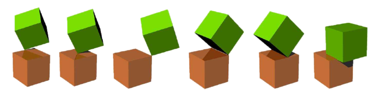
    <figcaption><a class="self-link" href="#fig-Topologische_Relaties_in_3D"></bdi></a>Zes voorbeelden van een zelfde topologische relaties "grenst aan"</figcaption>
</figure>

## Praktijkvoorbeeld
Om het gebruik van topologische relaties te verduidelijken, is een praktijkvoorbeeld uitgewerkt. Dit laat zien hoe ruimtelijke objecten zich tot elkaar verhouden en hoe deze relaties in de praktijk worden toegepast.

<figure id="3D_Infrastructureel_werk">
      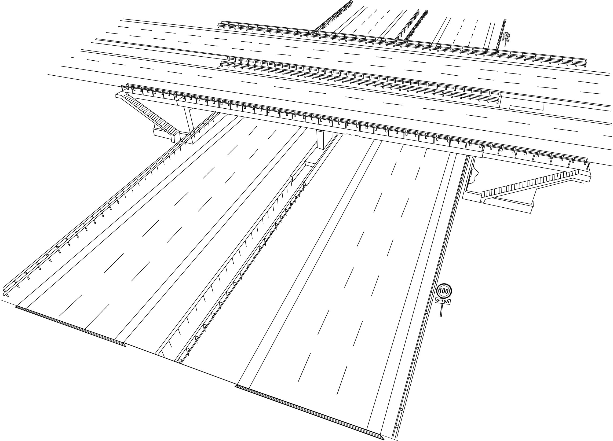
    <figcaption><a class="self-link" href="#fig-3D_Infrastructureel_werk"></bdi></a>Een voorbeeld model van een viaduct over een snelweg"</figcaption>
</figure>

Dit kan men zowel uitdrukken in IFC als in CityGML:

<figure id="3D_Infrastructureel_werk_CityGML">
      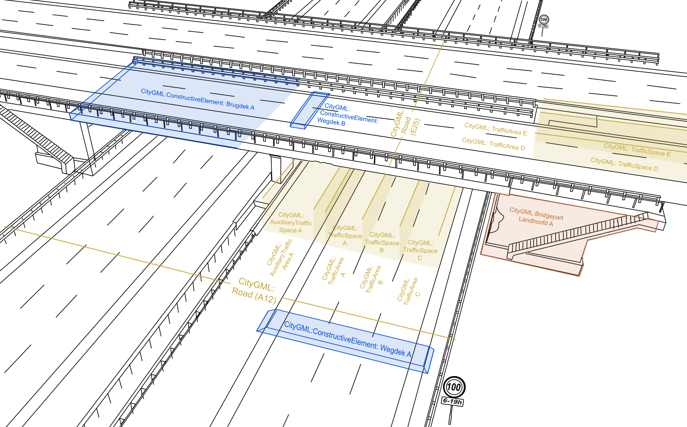
    <figcaption><a class="self-link" href="#fig-3D_Infrastructureel_werk_CityGML"></bdi></a>CityGML-concepten waarmee men een model van een viaduct over een snelweg kan modelleren"</figcaption>
</figure>
<figure id="3D_Infrastructureel_werk_IFC">
      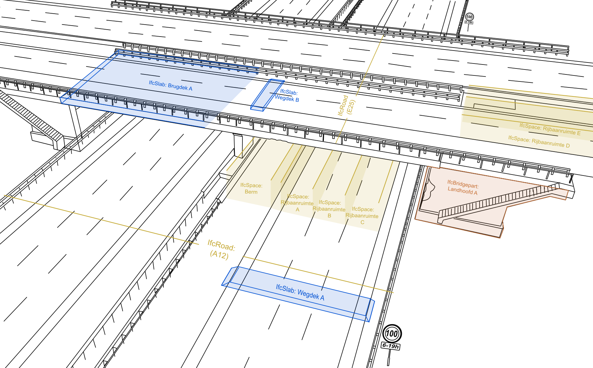
    <figcaption><a class="self-link" href="#fig-3D_Infrastructureel_werk_IFC"></bdi></a>IFC-concepten waarmee men een model van een viaduct over een snelweg kan modelleren"</figcaption>
</figure>

De elementen in CityGML en IFC zijn als volgt: 

<table>
  <tr>
        <td>CityGML</td>
        <td>IFC</td>
    </tr>
    <td>

- **`CityGML:Bridge`**: *`Viaduct Cattenbroekerdijk`*
  - **`CityGML:BridgePart`**: `Overspanning`
    - **`CityGML:ConstructiveElement`**: `Brugdek A`
    - **`CityGML:ConstructiveElement`**: `…`
  - **`CityGML:BridgePart`**: `Landhoofd A`
    - **`CityGML:ConstructiveElement`**: `Oplegconstructie A`
    - **`CityGML:ConstructiveElement`**: `…`

- **`CityGML:Road`**: *`A12`*
  - **`CityGML:TrafficSpace`**: `A`
    - **`CityGML:TrafficArea`**: `A`
  - **`CityGML:TrafficSpace`**: `B`
    - **`CityGML:TrafficArea`**: `B`
  - **`CityGML:TrafficSpace`**: `C`
    - **`CityGML:TrafficArea`**: `B`
  - **`CityGML:ConstructiveElement`**: `Wegdek`

- **`CityGML:Road`**: *`E25`*
  - **`CityGML:TrafficSpace`**: `D`
    - **`CityGML:TrafficArea`**: `D`
  - **`CityGML:TrafficSpace`**: `E`
    - **`CityGML:TrafficArea`**: `E`
  - **`CityGML:ConstructiveElement`**: `Wegdek B`
</td>
<td>

- **`IfcBridge`**: *`Viaduct Cattenbroekerdijk`*
  - **`IfcBridgePart`**: `Overspanning`
    - **`IfcSlab`**: `Brugdek A`
    - **`IfcBeam`**: `…`
  - **`IfcBridgePart`**: `Landhoofd`
    - **`IfcSlab`**: `Oplegconstructie`
    - **`IfcPile`**: `…`

- **`IfcRoad`**: *`A12`*
  - **`IfcRoadPart`**: `Rijrichting A`
    - **`IfcSlab`**: `Wegdek A`
    - **`IfcSpace`**: `Rijbaanruimte A`
    - **`IfcSpace`**: `Rijbaanruimte B`
    - **`IfcSpace`**: `Rijbaanruimte C`

- **`IfcRoad`**: *E25*
  - **`IfcRoadPart`**: `Rijrichting B`
    - **`IfcSlab`**: `Wegdek B`
    - **`IfcSpace`**: `Rijbaanruimte D`
    - **`IfcSpace`**: `Rijbaanruimte E`

</td>
</table>

Ten behoeve van consistentie van vlakdekkende kaarten zoals de BGT of ten behoeve van clashdetecties zijn topologische relaties als overlap, touches en disjoint belangrijk. De 2D en 3D topologische relaties tussen de elementen van deze praktijkcases verschillen. Een 3D standaard moet voorkomen dat (menselijke) interpretatie afhangt van projecties. Goed gedefinieerde 3D-topologische afspraken maken ruimtelijke relaties eenduidig en interpreteerbaar, waardoor ze zowel door mensen als machines begrepen kunnen worden.

<figure id="3D_Infrastructureel_werk_Topologisch_2D">
      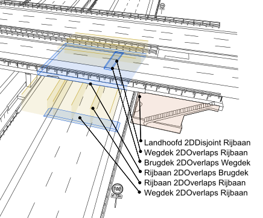
    <figcaption><a class="self-link" href="#fig-3D_Infrastructureel_werk_Topologisch_2D"></bdi></a>Topologisch 2D spatial operators voor een 3D model"</figcaption>
</figure>

<figure id="3D_Infrastructureel_werk_Topologisch_3D">
      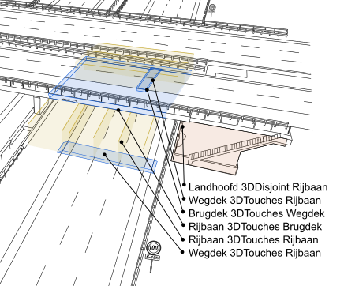
    <figcaption><a class="self-link" href="#fig-3D_Infrastructureel_werk_Topologisch_3D"></bdi></a>Topologisch 3D spatial operators voor een 3D model"</figcaption>
</figure>

### Relatieve richting relaties
Topologische relaties beschrijven de relaties tussen objecten onafhankelijk van het perspectief. Relatieve richting relaties geven relaties tussen objecten afhankelijke van het perspectief. In 2D kan men volstaan met links van, boven, naast etc. In 3D komen daar relaties bij als: boven/onder, voor/achter. De relatieve richting relaties helpen ook in 2D om context te geven, maar topologie (binnen, raak, overlap) dekt veel situaties. In 3D-omgevingen worden directionele relaties belangrijker, omdat hoogte en diepte extra dimensies introduceren die topologie alleen niet kan onderscheiden. Om te definieren dat een *"Schade onderin een burgdek zit"* is zowel een topologische relatie nodig ((3d)Containes) als de relatieve richting relatie (onder).

Deze relatieve locatie in combinatie met de topologische telaties is beschreven door Anne Göbels en Jakob Beetz in de [Reloc ontology](https://annegoebels.github.io/reloc/).

<figure id="Reloc_ontology">
      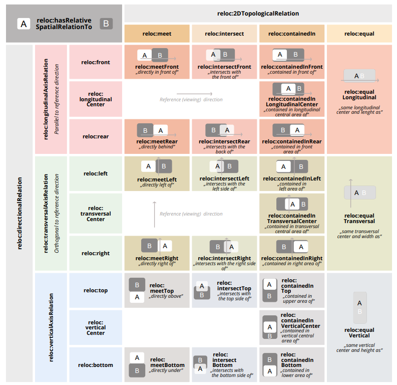
    <figcaption><a class="self-link" href="#fig-3D_Infrastructureel_werk_Topologisch_3D"></bdi></a> 
        De <a href="https://ceur-ws.org/Vol-3824/paper7.pdf" target="_blank">Reloc ontology</a> beschreven door Anne Göbels en Jakob Beetz.
        </figcaption>
</figure>

Deze ontologie brengt de natuurlijke taal dichter bij het 3D-model door een formalisatie van de beschrijving in relatieve richting en topologie. 

<figure id="Relatieve richting relaties">
      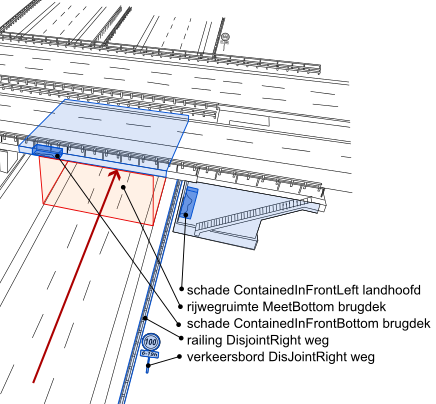
    <figcaption><a class="self-link" href="#fig-3D_Infrastructureel_werk_Topologisch_3D"></bdi></a>Relatieve richting relaties"</figcaption>
</figure>

Dit biedt kansen voor Artificiele Inteligentie en Large Language Models. LLM's begrijpen teksten als "schade op het voorste deel van de tweede overspaning, aan de linkerzijde van de onderkant". LLM's weten echter niet waar dit in een 3D-model zit. Initiatieven als een RELOC ontology vertalen de tekst naar formele 3D-relaties.

## Geometrie:
Er zijn verschillende benaderingen voor het definieren van (3D) geometrie. In hoofdlijnen komt dit neer op de volgende groepen: 

<figure id="drie_benaderingen_IFC_geometrie">
      
      <figcaption>
        <a class="self-link" href="#fig-drie_benaderingen_IFC_geometrie"></bdi></a>
        
        Drie verschillende benaderingen soorten geometrie in IFC   
        bron:
        <a href="https://resolver.tudelft.nl/uuid:31380219-f8e8-4c66-a2dc-548c3680bb8d" target="_blank">Automatic generation of CityGML LoD3 building models from IFC models</a> S. Donkers
        
      </figcaption>
</figure>

GIS ondersteunt meestal alleen expliciete geometrie, zoals meshes en boundary representations (BRep). IFC ondersteunt zowel expliciete als impliciete geometrie. Naast expliciete meshes en BReps ondersteunt IFC ook geometrie zoals sweeps en constructive solid geometry (CSG). Deze impliciete geometrie maakt het mogelijk om zeer complexe vormen op te slaan in een relatief licht formaat met behulp van wiskundige vergelijkingen.

De Boundary Representation methode beschrijft een 3D-volume door de geometrie die het 3D volume begrenst. Dit komt sterk overeen met de manier waarop de Geo-standaarden voor geometrie ook werken. De IFC-geometrie waarmee men een 3D-boundary representation kan maken kent geometrie-typen die in de Geo-standaarden niet ondersteund worden. 

<figure id="Advanced_Brep">
      
      <figcaption>
        <a class="self-link" href="#fig-Advanced_Brep"></bdi></a>
        
        Advanced BRep in IFC gebruik makend van NURBS-curves voor de definitie van de boundary surfaces.   
        bron:
        <a href="https://ifc43-docs.standards.buildingsmart.org/" target="_blank">Building Smart International</a>
        
      </figcaption>
</figure>

Daarnaast kent IFC de methode om op basis van 3D-primitieven en boolean operations tot de juiste 3D-vorm te komen. IFC 4x3 kent onderstaande primitieven:

<figure id="3DPrimitives">
      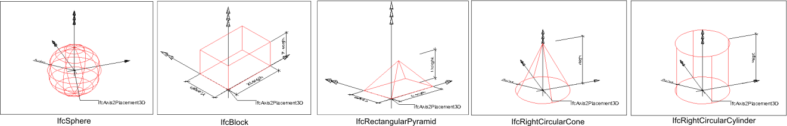
      <figcaption>
        <a class="self-link" href="#fig-3DPrimitives"></bdi></a>
        
        3D Primities in IFC   
        bron:
        <a href="https://ifc43-docs.standards.buildingsmart.org/" target="_blank">Building Smart International</a>
        
      </figcaption>
</figure>

Deze primitieven kan men samenvoegen, de overlappende delen behouden of de verschillen behouden. 3D primitieven met Union, Intersection en Difference kunnen resulteren in complexe geometrie die met een Boundary representation methode veel meer data kost om dezelfde vormen te beschrijven.

<figure id="CSG">
      
      <figcaption>
        <a class="self-link" href="#fig-CSG"></bdi></a>
        
        Constructive Solid Geometry met 3D primitieven en Boolean Operators   
        bron:
        <a href="https://mit-crpg.github.io/OpenMOC/methods/constructive_solid_geometry.html" target="_blank">Massachusetts Institute of Technology, 2019</a>
        
      </figcaption>
</figure>

Tenslotte kent IFC een Sweep Volume om 3D geometrie te duiden. Met deze methodiek definieert men een vlak die men over een bepaald pad kan extruderen.

<figure id="Sweep_volume">
      
      <figcaption>
        <a class="self-link" href="#fig-Sweep_volume"></bdi></a>
        
        Sweep volumes   
        bron:
        <a href="https://ifc43-docs.standards.buildingsmart.org/" target="_blank">Building Smart International</a>
        
      </figcaption>
</figure>

Omdat er zoveel verschillende manieren van het definieren van 3D geometrie in IFC zijn zijn er weinig applicaties en viewers die met al deze geometrieën om kunnen gaan. Het is mogelijk om de diversiteit van geometrie te reduceren door geometrie om te rekenen. 

Als een IFC-bestand impliciete geometrie bevat, en conversie gewenst is. Dient impliciete geometrie, expliciet gemaakt te worden door benadering. Geometrie kan men omrekenen naar meshes en boundary representation (Brep). Deze benaderingen komen vaak redelijk dicht bij het originele model, maar er zijn verschillen. Meestal zijn de ruimtelijke verschillen klein en verwaarloosbaar voor de meeste GIS-toepassingen.

<figure id="Mesh_van_Geometrie">
      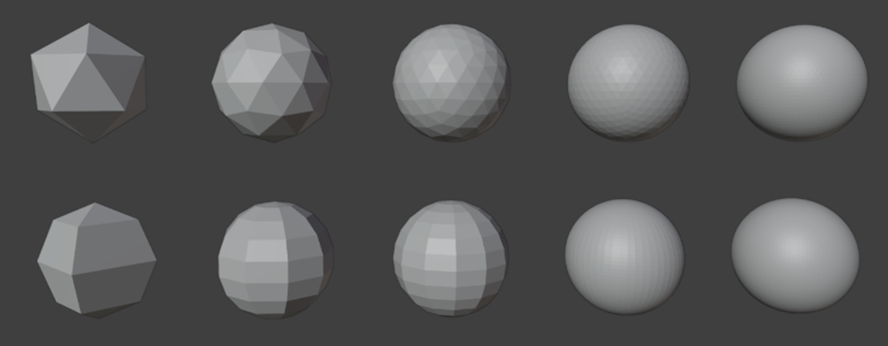
      <figcaption>
        <a class="self-link" href="#fig-Mesh_van_Geometrie"></bdi></a>
        
        Mesh van een sphere op verschillend detailniveau en verschillende basis-vormen
        
      </figcaption>
</figure>

Het is mogelijk om in OpenBIM, IFC, een subset van geometrie af te dwingen. Hiervoor kan men gebruik maken van een [Model View Definition](https://openbim-knowledgebase.org/en/docs/bimcert-manual-2024/chapter-3-in-depth-knowledge/chapter-3-3-model-view-definition-mvd/). Zie de Reference View in de [MVD-database](https://technical.buildingsmart.org/standards/ifc/mvd/mvd-database/). IFC's die worden geleverd en zich houden aan deze model view definition kunnen daardoor door meer viewers en software ingelezen worden. Het is aan software om deze output te leveren.
Men heeft hierbij geen grip op de instellingen en kwaliteit van de output. Dit is aan de software. 

Wanneer dit wel van belang is kan aparte tooling als [ifcBuildingEnvExtrator](https://github.com/tudelft3d/IFC_BuildingEnvExtractor) ingezet worden. Bij deze tooling heeft men grip op de instellingen van conversie. 

Naast eisen voor kwaliteit van geometrie zullen er eisen zijn aan de entiteiten uit BIM die niet meegenomen moeten worden als een lager detailniveau gewenst is. Bijvoorbeeld een antenne of een deurklink kan buiten beschouwing gelaten worden wanneer een BIM-model naar een lager detailniveau gebracht dient te worden. 

<aside class="note" title="Stel inwinningsregels voor IFC op">
  
<strong>AANBEVELING:</strong> Stel inwinningsregels voor IFC-conversie op. Dit kan met een IFC Model View Definition Reference View en/of met convertors als IfcBuildingEnvExtractor of IFCConvert geleverd worden.

</aside>

Door het veranderen van het model en de impliciete geometrie naar expliciete geometrie verandert het bestandformaat. BIM-modellen met veel impliciete geometrie kunnen behoorlijk groter worden als daar expliciete geometrie van gemaakt wordt. Het tabel_chairs model is 69 maal zo groot in GeoJSON (expliciet) als in IFC (impliciet). 

| model | Bestandsgrootte IFC (KB) | Bestandsgrootte GeoJSON mapping (KB)*|  
|-|-|-|
| A20 Corridor    | 7.787     | 2.094  |   
| aisc_sculpture_param    | 314   | 4.206 |   
| ifcbridge-model01 | 14.817  | 26.049 |    
| ifcbridge-model04 | 55  | 296 |    
| ifcbridge-model05 | 25 | 205 | 
| tabel_chairs | 705 | 48.641 |
| kievitsweg_R25 | 13.706 | 65.386 |

