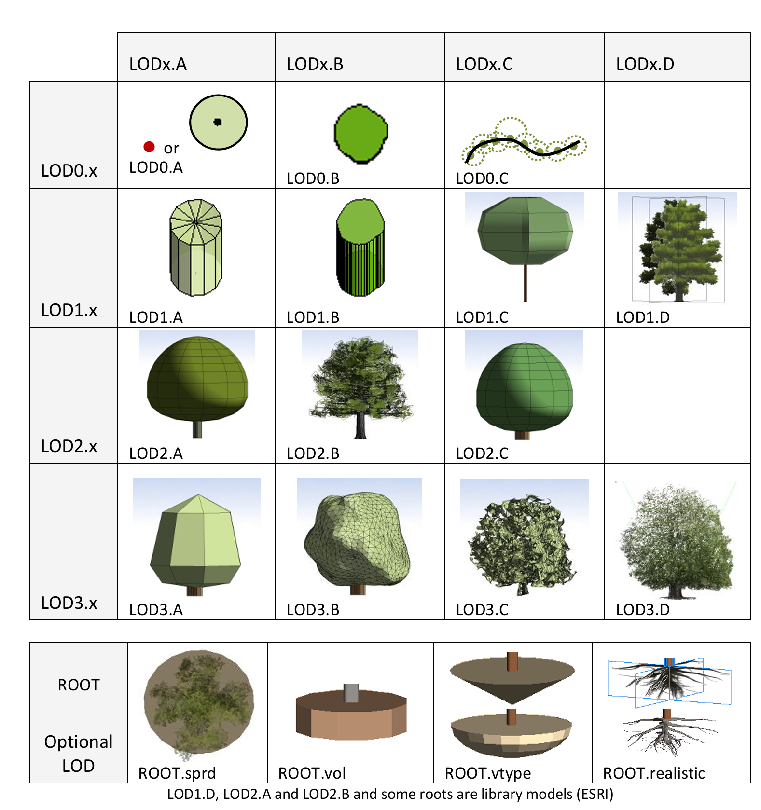
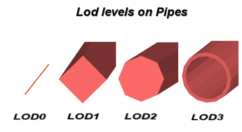

# Objecttypen

Onderzoeksvraag: *Voor welke soorten objecten en daarmee samenhangende datasets zou deze standaard moeten gelden?*

We kijken naar twee use cases die vooral focussen op de SOLL situatie en antwoord geven op de vraag wat is er nodig aan standaarden om naar die SOLL situatie te komen.

De use cases zijn:

- DTaaS: Digital Twin as a Service. In DTaaS komen diverse use cases aan de orde zoals hittestress en overstroming van steden, waarbij een 3D stadsmodel nodig is om simulaties te kunnen doen. DTaaS maakt gebruik van 3D geo-objecten maar schrijft geen standaard voor. Voor een vergroot gebruik van Digital Twins is een 3D standaard aan te bevelen. Door Digital Twin als usecase te gebruiken versterken we ook de relatie tussen het ZoN Datafundament en het ZoN Digital Twin programma.
- Informatiemodel Geluid. Geluid is bij uitstek een fenomeen dat beïnvloed wordt door de 3D ruimte en men heeft 3D objecten nodig om binnen de geluidsmodellen te kunnen bepalen welk geluid hoe hard ergens aankomt, gegeven de locatie van de geluidsbron en de fysieke objecten die het geluid onderweg tegenkomt.

De NEN 3610 is een top-ontologie waarin verschillende ruimtelijke en reeele concepten samenkomen tot één gedeeld model van de fysieke leefomgeving. Onderstaand figuur toont de nen3610:2022. De figuur toont van deze NEN versie welke objecttypen er gedefinieerd zijn.
In het geval van dit onderzoek zal de focus liggen op zowel alle objecten onder reelobject als een aantal ruimtes onder virtuele ruimte. Dit zijn o.a. de ruimten die in de BGT (Functioneel gebied en Registratief gebied) en BAG (Juridische Ruimte) voorkomen.  

<figure>

    <figcaption>overzicht van objecttypen uit NEN3610:2022</figcaption>
</figure>

Als we deze objecttypen mappen op het IMBGT dan ontstaat het volgende beeld. Het hoofdobjecttype <strong>Constructie</strong> in NEN:22 komt grotendeels overeen met het abstracte hoofdobjecttype Bouwwerk in BGT. Hieronder vallen ook de kunstwerken zoals tunnels en overbruggingen.

<figure>

 <figcaption>overzicht van objecttypen uit IMBGT met NEN3610 klasses</figcaption>
</figure>

# IMGeo-objecten en geometrie
De BGT objecten zijn zoals beschreven in paragraaf 2.6 van de <mark>BGT Specificatie</mark> specifiek tweedimensionaal. Wel wordt de stap naar 3D al beschreven. Deze stap wordt verder toegelicht in pargaraf 2.5 van de <mark>IMGEO specificatie</mark>

Wegdeel
Ondersteunend wegdeel
Spoor
Onbegroeid terreindeel
Begroeid terreindeel
Waterdeel
Ondersteunend waterdeel
Pand
Overig bouwwerk
Kunstwerk
Overbruggingsdeel
Tunneldeel
Kunstwerkdeel
Scheiding
Functioneel Gebied
Overige Scheiding
Bak
Bord
Gebouwinstallatie
Installatie
Kast
Mast
Paal
Put
Sensor
Straatmeubilair
Waterinrichtings-element
Weginrichtings-element
Vegetatieobject
RegistratiefGebied
Buurt
OpenbareRuimte
Stadsdeel
Waterschap
Wijk

Woonplaats 
Ligplaats   
Pand   
Standplaats 
Verblijfsobject 

KabelOfLeiding  
KabelEnLeidingContainer
Leidingelement
ContainerLeidingelement

Moenteel bevinden alle BGT objecten zich in een 2D ruimte. In een 3D standaard voor bovenstaande objecten wordt de ruimte waarin deze objecten zich bevinden 3D. De geometrie van deze objecten kan daarmee toenemen in dimensie, maar dit is niet altijd noodzakelijk of wenselijk. Wellicht is een 2D vlakgeometrie (LOD 0) voor onbegroeide terreindelen in 3D voldoende. Dit is onderwerp voor vervolgonderzoek.

Vegetation LOD definitions by Ortega-Córdova [p. 29 in Ortega-Córdova (2018)] (CC-BY license; some images are based on ESRI library models) and by Zhang et al. (p. 204 in Zhang et al. (2022))!

<mark>Urban Vegetation Modeling 3D Levels of Detail</mark>

 Het gebruik van dezelfde 3D-representatie binnen de basisregistraties zorgt ervoor dat men egevens onderling kan vergelijken en combineren. Het bevordert de interoperabiliteit en voorkomt verschillen in interpretatie van geometrieën. 
 
<aside class="note" title="Ontwikkel een 3D representatiestandaard">
  
<strong>AANBEVELING:</strong> OOntwikkel een 3D-representatiestandaard die aansluit bij nu al aanwezige 2D-representatie van de basisregistraties. Door een gezamenlijke standaard te hanteren, kunnen 3D-gegevens in de toekomst eenvoudiger worden gecombineerd, vergeleken en uitgewisseld. Dit bevordert de interoperabiliteit tussen datasets en voorkomt verschillen in de interpretatie en modellering van objecten.

</aside>

Rioleringsobjecten en kabels en leidingen (KLIC) objecten zijn geen onderdeel van de BGT/IMGeo. Deze onderdelen zijn wel onderdeel van IMKL. Het verplichte geometrieprofiel van IMKL is 2D. Primair bestaat de geometrie uit punten en lijnen die het netwerk representeren. 2D vlakken zijn additioneel waarbij ook multivlakken zijn toegestaan. 2,5 D en 3D zijn een additionele extensie. 
3D geometrie.

In IMKL is de mogelijkheid opgenomen om objecten in 3 dimensies (3D) te modelleren. Deze mogelijkheid is optioneel en is naast, niet in plaats van, 2D aanwezig. Dat betekent dat de basis uitgaat van een (volledige) 2D data set. Daarnaast kan, in dezelfde data set, 3D geometrie voor een of meerdere van de objecten aanwezig zijn. 

Deze 3D geometrie kan beschikbaar zijn in twee verschillende ‘Levels of Detail’ (LOD). Allereerst kunnen 2.5D punten, vlakken en lijnen worden opgenomen. Dit kan beschouwd worden als Level of Detail 0 (LOD0). Elk IMKL vlak, lijn- of puntobject krijgt voor elk coördinatenpaar een z waarde. Om de ligging in 3D te beschrijven krijgt de lijn extra coördinatenparen ten opzichte van de 2D representatie. De objecten kunnen dan in een Digitaal Terrein Model (3D terreinmodel) worden geïntegreerd en op de juiste hoogte onder of boven maaiveldniveau worden gerepresenteerd.

Daarnaast is het mogelijk om volledige 3D geometrie op te nemen. Dit is te beschouwen als Level of Detail 1 (LOD1) en maakt het mogelijk om IMKL objecten als volledige 3D objecten (volumes) te representeren. 

