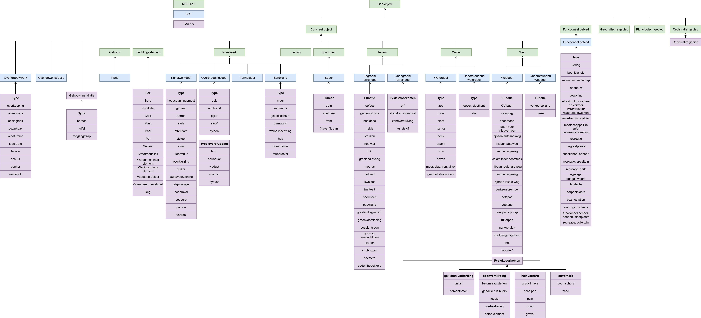
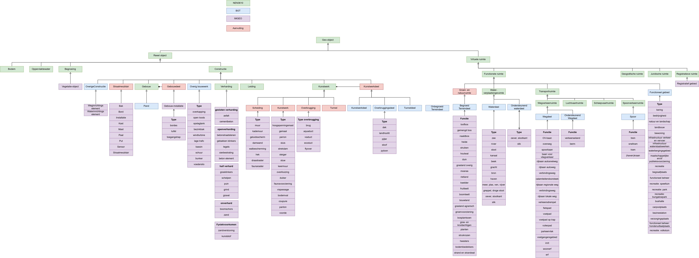
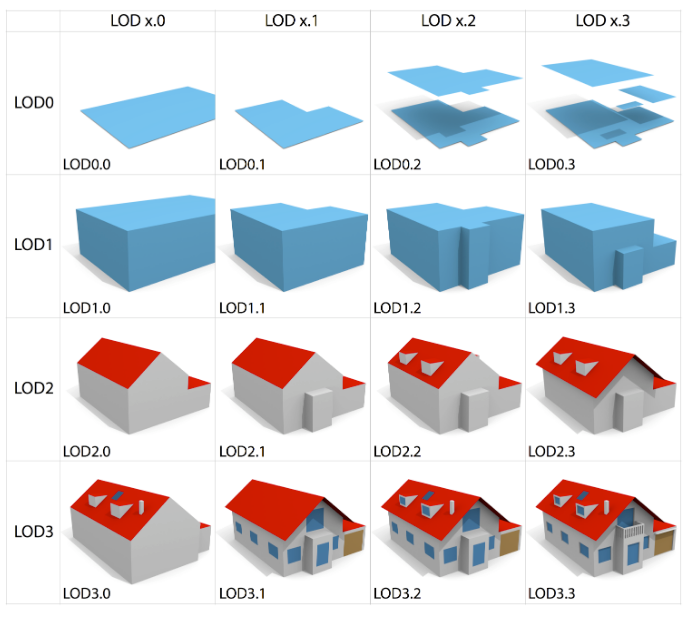
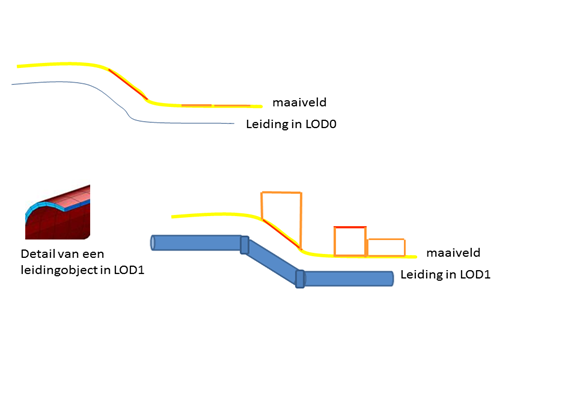

# Objecttypen

Onderzoeksvraag: *Voor welke soorten objecten en daarmee samenhangende datasets zou deze standaard moeten gelden?*

We kijken naar twee use cases die vooral focussen op de SOLL situatie en antwoord geven op de vraag wat is er nodig aan standaarden om naar die SOLL situatie te komen.

De use cases zijn:

- DTaaS: Digital Twin as a Service. In DTaaS komen diverse use cases aan de orde zoals hittestress en overstroming van steden, waarbij een 3D stadsmodel nodig is om simulaties te kunnen doen. DTaaS maakt gebruik van 3D geo-objecten maar schrijft geen standaard voor. Voor een vergroot gebruik van Digital Twins is een 3D standaard aan te bevelen. Door Digital Twin als usecase te gebruiken versterken we ook de relatie tussen het ZoN Datafundament en het ZoN Digital Twin programma.
- Informatiemodel Geluid. Geluid is bij uitstek een fenomeen dat beïnvloed wordt door de 3D ruimte en men heeft 3D objecten nodig om binnen de geluidsmodellen te kunnen bepalen welk geluid hoe hard ergens aankomt, gegeven de locatie van de geluidsbron en de fysieke objecten die het geluid onderweg tegenkomt.

De NEN 3610 is een top-ontologie waarin verschillende ruimtelijke en reeële concepten samenkomen tot één gedeeld model van de fysieke leefomgeving. Onderstaande figuur toont de nen3610:2011, BGT en IMGEO. De figuur toont van deze NEN-versie en BGT|IMGEO welke objecttypen er gedefinieerd zijn.
In het geval van dit onderzoek zal de focus liggen op zowel alle objecten onder concreet object als de objecten onder de verschillende gebieden. Dit is nodig voor de concrete objecten, maar ook de ruimten die in de BGT en BAG voorkomen.  

In de beschreven eerste iteratie zal de focus liggen op BGT:Pand met het bovenliggende NEN3610:Gebouw en op het BGT:Overbruggingsdeel met het bovenliggende NEN3610:Kunstwerk en onderliggende IMGEO type overbrugging: brug, aquaduct, viaduct, ecoduct, flyover en IMGEO type: dek, landhoof, pijler, sloof en pyloon.   

<figure id="BGT_NEN3610_2011_overzicht">
  

  <figcaption>
    Overzicht van objecttypen uit NEN3610:2011 BGT en IMGEO
  </figcaption>
</figure>

Een nieuwe versie van de NEN3610 is uitgebracht in 2022. De huidige BGT is echter nog uitgelijnd op de vorige versie, NEN3610:2011. Als we de objecttypen van het IMBGT als verkenning mappen op het NEN3610:2022 [[NEN3610]] model dan ontstaat onderstaand beeld. Het hoofdobjecttype <strong>Constructie</strong> in NEN:3610 komt grotendeels overeen met het abstracte hoofdobjecttype Bouwwerk in BGT. Hieronder vallen ook de kunstwerken zoals tunnels en overbruggingen. In de nieuwe versie van de NEN3610 bestaat er een duidelijker onderscheid tussen *Reeel object* en *Virtuele ruimte*. Dit is een belangrijk verschil in de uitwerking van een 3D standaard. 

<figure id="BGT_NEN3610_2022_overzicht">
  
  <figcaption>
    Voorstelling van objecttypen uit NEN3610:2022 en hoe een mapping naar BGT en IMGEO zou kunnen zijn.
  </figcaption>
</figure>

Men moet een keuze maken bij de ontwikkeling van een 3D standaard: 
1) Ontwikkeling van een 3D standaard op basis van de huidige BGT in samenhang met de NEN3610:2011. 
2) Ontwikkeling van een 3D standaard op basis van een toekomstige BGT in samenhang met de NEN3610:2022.

<aside class="note" title="Keuze tussen NEN3610 en BGT versies voor een 3D standaard">
  
<strong>AANBEVELING:</strong> Maak een keuze tussen een 3D standaard voor of de huidige BGT in samenhang met de eerdere versie NEN3610:2011 of voor een toekomstig BGT in samenhang met de huidige versie NEN3610:2022.

</aside>

# IMGeo-objecten en geometrie
De BGT objecten zijn, zoals beschreven in paragraaf 2.6 van de [BGT Specificatie](https://docs.geostandaarden.nl/imgeo/catalogus/bgt/#modellering), specifiek tweedimensionaal. Wel wordt de stap naar 3D al beschreven. Deze stap wordt verder toegelicht in paragraaf 2.5 van de [IMGEO specificatie](https://docs.geostandaarden.nl/imgeo/catalogus/imgeo/#x3d-in-imgeo).

BAG objecten zijn zoals beschreven in [Catalogus BAG 2018](https://www.geobasisregistraties.nl/documenten/2018/03/12/catalogus-2018) specifiek tweedimensionaal. Het is mogelijk om deze objecten in een 3D ruimte weer te geven. De 3D BAG en 3D Basisvoorziening, ontwikkeld door de TUDelft en het Kadaster, zijn niet gestandaardiseerd. 

Objecten conform het IMKL zijn verplicht 2D met een mogelijkheid om 3D extra geometrie toe te voegen zoals beschreven in de [IMKL-specificatie](https://docs.geostandaarden.nl/kl/imkl/#geometrie-en-topologie). 

Ook veel [BRO-objecten](https://docs.geostandaarden.nl/bro/) kennen een 2D geometrie. 

Momenteel bevinden BGT objecten zich in een 2D ruimte. De BAG kent ook objecten in de 3D ruimte. Het IMKL en de BRO kennen ook objecten in de 3D ruimte. In een 3D standaard voor objecten wordt of blijft de ruimte waarin deze objecten zich bevinden 3D. De geometrie van deze objecten kan daarmee toenemen in dimensie, maar dit is niet altijd noodzakelijk of wenselijk. Wellicht is een 2D vlakgeometrie (LOD 0) voor onbegroeide terreindelen in 3D voldoende. Dit is onderwerp voor vervolgonderzoek.

Een overzicht van de objecten van de BGT, BAG, het IMKL en de BRO zijn in de bijlagen 1 tot 4 weergegeven. 

# Level of Detail en inwinningsregels

Het is mogelijk om in 3D op verschillend detailniveau de werkelijkheid weer te geven. In 2D is dit niet anders. Voor de BGT en IMGEO bestaan er inmeetregels voor elk object. Zie bijvoorbeeld de [inmeetregels voor een gebouw in de BGT](https://geonovum.github.io/IMGeo-objectenhandboek/pand#inwinningsregels).

In het 3D-GEO domein bestaan er verschillende gestandaardiseerde Levels Of Details. Deze zijn gespecificeerd in de [[CityGML3]] standaard die 3 levels onderscheid.

Door de TU-Delft is hier een aanvulling op gemaakt. In 2016 heeft [Biljecki et al.](https://pure.tudelft.nl/ws/portalfiles/portal/4377508/Biljecki2016to.pdf) daarom een verfijning geschreven die voortbouwt op het CityGML LoD framework.

<figure id="Voorbeeld-van-de-16-LoDs-beschreven-door-de-TUDelft" style="display: block; text-align: center; margin: 0 auto;">
      
      <figcaption>
        <a class="self-link" href="#fig-Voorbeeld-van-de-16-LoDs-beschreven-door-de-TUDelft"></bdi></a>
        
        Voorbeeld van de 16 LoD's beschreven door de  <a href="https://3d.bk.tudelft.nl/lod/" target="_blank">TU Delft</a> in 2016.
        
      </figcaption>
</figure>

De LOD's zijn het meest uitgebreid uitgewerkt voor gebouwen. Voor andere objecten moet dit gecreëerd worden. Wanneer beschikbaar kan er gebruik gemaakt worden van wetenschappelijk onderzoek of al aanwezige specificaties zoals hieronder getoond vanuit Ortega Córdova voor solitaire vegetatieobjecten of de LOD beschrijving uit het IMKL. 

<figure id="Voorbeeld-van-de-LoDs-voor-vegetatie" style="display: block; text-align: center; margin: 0 auto;">
      
      <figcaption>
        <a class="self-link" href="#fig-Voorbeeld-van-de-16-LoDs-beschreven-door-de-TUDelft"></bdi></a>
        
        Urban Vegetation Modeling 3D Levels of Detail  <a href="https://www.researchgate.net/publication/378353206_Recommendation_for_Vegetation_Information_in_Semantic_3D_City_Models_Used_in_Urban_Planning_Applications" target="_blank">Ortega-Córdova</a> in 2018.
        
      </figcaption>
</figure>

Deze 3D geometrie van IMKL kan beschikbaar zijn in twee verschillende ‘Levels of Details’ (LOD). Allereerst kunnen 2.5D punten, vlakken en lijnen worden opgenomen. Dit kan beschouwd worden als Level of Detail 0 (LOD0). Elk IMKL vlak, lijn- of puntobject krijgt voor elk coördinatenpaar een z waarde. Om de ligging in 3D te beschrijven krijgt de lijn extra coördinatenparen ten opzichte van de 2D representatie. De objecten kunnen dan in een Digitaal Terrein Model (3D terreinmodel) worden geïntegreerd en op de juiste hoogte onder of boven maaiveldniveau worden gerepresenteerd.

Daarnaast is het mogelijk om volledige 3D geometrie op te nemen. Dit is te beschouwen als Level of Detail 1 (LOD1) en maakt het mogelijk om IMKL objecten als volledige 3D objecten (volumes) te representeren. 

 Het gebruik van dezelfde 3D-representatie binnen de basisregistraties zorgt ervoor dat men gegevens onderling kan vergelijken en combineren. Het bevordert de interoperabiliteit en voorkomt verschillen in interpretatie van geometrieën. 
 
<aside class="note" title="Ontwikkel een 3D representatiestandaard">
  
<strong>AANBEVELING:</strong> Ontwikkel een 3D-representatiestandaard die aansluit bij nu al aanwezige 2D-representatie van de basisregistraties. Door een gezamenlijke standaard te hanteren, kunnen 3D-gegevens in de toekomst eenvoudiger worden gecombineerd, vergeleken en uitgewisseld. Dit bevordert de interoperabiliteit tussen datasets en voorkomt verschillen in de interpretatie en modellering van objecten.

</aside>

